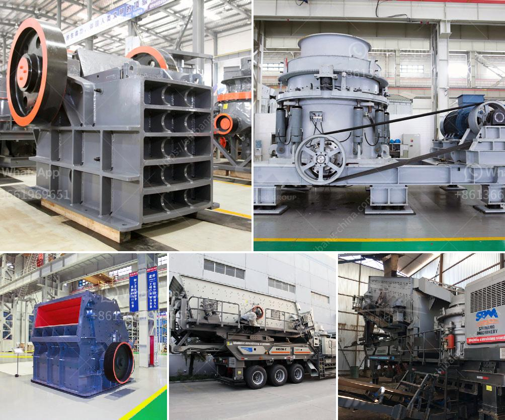

<h3>coal handling coal transfer by conveyors coal crusher</h3>
Coal is a fossil fuel that has been used for centuries as a source of energy. One of the main ways that coal is being used today is in power generation, where it is burned to produce steam that drives turbines to generate electricity. However, before coal can be burned, it needs to be processed and prepared for use. In this article, we will be discussing the various steps involved in coal handling, particularly the coal transfer by conveyors and the role of a coal crusher.

Coal handling is an essential part of the coal-fired power generation process. The process involves the unloading of coal from trains or ships, and then transporting the coal by conveyors to coal bunkers. From the bunkers, the coal is fed into the pulverizer and crushed into a fine powder. The powdered coal is then transported to the boilers via primary air fans, where it is burned to produce steam.

Conveyors play a crucial role in the coal handling process. They are responsible for transferring the coal from one location to another. Coal transfer by conveyors can take place horizontally, vertically, or at an inclined angle. The choice of conveyor depends on various factors such as the distance of coal transfer, the installation site conditions, and the power requirements.

Horizontal conveyors are commonly used for short-distance coal transfer, while inclined conveyors are suitable for longer distances and for situations where coal needs to be transported uphill. Vertical conveyors, on the other hand, are used to lift coal from lower levels to higher levels.

A coal crusher is a machine designed to reduce large coal chunks into smaller ones. The process involves breaking down raw coal materials into a manageable size suitable for transportation or conveying. Coal crushing systems are equipped with surge bins, crushers, and conveyors that handle and process the coal materials.

When the coal is crushed, it is screened and sorted into various size categories. Different crushers are used depending on the desired output size, with jaw crushers and impact crushers being commonly used for the primary and secondary crushing stages.

Efficient coal handling and crushing are essential in power plants. The processed coal is then used for power generation, so any inefficiency in the handling and crushing process can lead to increased costs and reduced power generation efficiency.

Proper coal handling and crushing ensure that the coal is delivered to the boilers at a consistent particle size and meets specified requirements. This reduces the likelihood of blockages in the coal delivery system and promotes smooth operations.

Coal handling and crushing are crucial steps in the coal-fired power generation process. The coal transfer by conveyors and the use of a coal crusher are essential for enhancing the efficiency and reliability of coal-fired power plants. They also help minimize the environmental impact of coal preparation and handling. Hence, it is important to invest in advanced coal handling equipment and systems to ensure optimal performance and sustainability in power generation.
<h3>Contact us</h3><ul><li><strong>Whatsapp:&nbsp;<a href="https://wa.me/8613661969651">+8613661969651</a></strong></li><li><a href="https://swt.shibang-china.com/?git&amp;zhl&amp;coal handling coal transfer by conveyors coal crusher"><strong>Online Service(chat now)</strong></a></li></ul><h3>Related</h3><ul><li><a href='aggregate crusher plant keesara.md'>aggregate crusher plant keesara</a></li><li><a href='cone crusher msp300.md'>cone crusher msp300</a></li><li><a href='lime stone crusher with capacity.md'>lime stone crusher with capacity</a></li><li><a href='crusher machine ball media.md'>crusher machine ball media</a></li><li><a href='crushers made in south philippines.md'>crushers made in south philippines</a></li></ul>