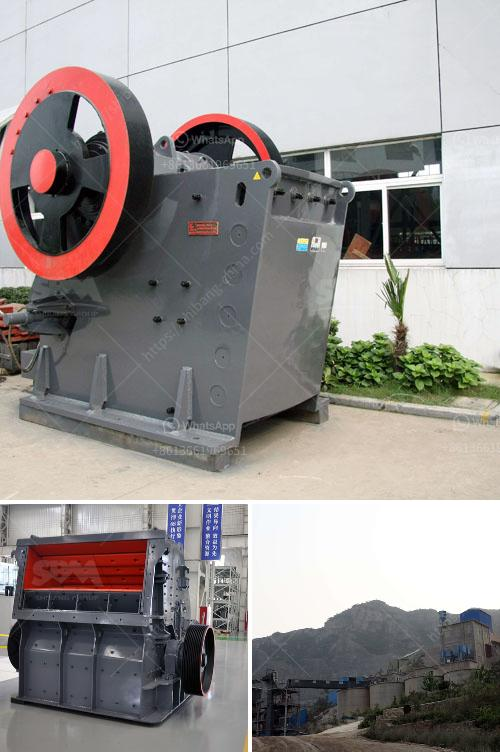

<h3>coal manufacturing machine price in malaysia</h3>
Coal manufacturing machines are essential equipment used in the production of coal, transforming raw coal into valuable resources. In Malaysia, as a significant producer and exporter of coal, the coal manufacturing machine plays a crucial role in maintaining the sustainability and efficiency of the coal mining industry.

When it comes to the price of coal manufacturing machines in Malaysia, several factors come into play. The size, capacity, and features of the machine significantly influence its cost. Generally, larger machines with higher capacities tend to be more expensive due to their ability to process larger quantities of coal efficiently.

Moreover, the brand and reputation of the manufacturer can also impact the price. Renowned manufacturers often charge a premium for their machines, as they are known for their reliability, durability, and advanced technology. These trusted brands usually provide better after-sales service and spare parts availability, making them a preferred choice despite their higher price range.

Additionally, the level of automation and technological advancements in the machine can influence its price. Machines equipped with advanced control systems, data analytics, and remote monitoring capabilities tend to carry a higher price tag. However, these sophisticated features can significantly enhance productivity and streamline operations, making them a worthwhile investment.

In Malaysia, the price range for coal manufacturing machines generally varies from MYR 2 million to MYR 10 million. However, it is essential to note that these figures are approximate and can vary depending on various factors such as the specific requirements of the coal mining operation and the supplier's pricing policies. It is recommended for potential buyers to conduct thorough research, compare prices, and negotiate with different manufacturers to find the most competitive price for their specific needs.

In conclusion, the price of coal manufacturing machines in Malaysia is influenced by factors such as size, capacity, features, brand reputation, and level of automation. Buyers should consider these factors and conduct comprehensive research to find the most suitable and cost-effective machine for their coal mining operations. Investing in a reliable and efficient coal manufacturing machine is crucial for sustaining the coal mining industry and meeting the increasing demand for energy resources.
<h3>Contact us</h3><ul><li><strong>Whatsapp:&nbsp;<a href="https://wa.me/8613661969651">+8613661969651</a></strong></li><li><a href="https://swt.shibang-china.com/?git&amp;zhl&amp;coal manufacturing machine price in malaysia"><strong>Online Service(chat now)</strong></a></li></ul><h3>Related</h3><ul><li><a href='screens vibrating screens mobile.md'>screens vibrating screens mobile</a></li><li><a href='conveyor belting south africa.md'>conveyor belting south africa</a></li><li><a href='graphite processing flowsheet.md'>graphite processing flowsheet</a></li><li><a href='pebble stone processing machines.md'>pebble stone processing machines</a></li><li><a href='turkish association marble machinery.md'>turkish association marble machinery</a></li></ul>