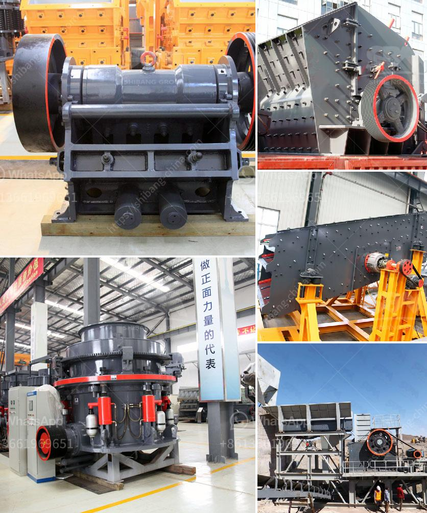

<h3>coal mill hydraulic system principles</h3>
Coal mill hydraulic system principles The grinding force for coal pulverization is applied by a loading frame. This frame is connected to a hydraulic system, which operates at a moderate pressure. The grinding force is applied to the grinding table by a hydraulic cylinder. The force is transmitted to the grinding rollers by means of hydraulic cylinders and grinding roller arms.

The coal mill hydraulic system is used to provide pressure to the grinding roller. The pressure can be controlled by adjusting the pump displacement and the pressure of the hydraulic accumulator. Roller mills are widely used for grinding raw coal, clinker, slag, gypsum, and limestone in the cement industry, and for coal injection in blast furnaces and for the grinding of coal in power plants.

The emergence of vertical mills has brought new hope to the coal industry. Vertical mills have higher grinding efficiency and lower power consumption. However, in the process of production, some abnormal phenomena may occur. For example, the vibration of the mill. Vibration phenomena in the operation of vertical roller mill and its control measures are discussed in this paper.

The coal mill hydraulic system is an important part of the grinding equipment and has a great influence on the commissioning operation and maintenance of the mill. In this article, the coal mill hydraulic system principles will be introduced to you.

Hydraulic pressure is generated in the hydraulic system by a hydraulic pump, and it is continuously transmitted to the cylinder by the hydraulic valves and the pipeline. The movement of the cylinder drives the movement of the grinding roller, and the pressure can be controlled by adjusting the pump displacement. The hydraulic system is equipped with a pressure relief valve, which can adjust the outlet pressure of the pump according to the required working conditions. The pressure of the hydraulic accumulator can also be adjusted to control the pressure of the grinding roller.

The coal mill hydraulic system is equipped with a lubrication system, which can lubricate the roller bearings, moving parts of the grinding table, and the rollers separately. In order to maintain good lubrication, extend the service life of equipment and increase production efficiency, a reasonable amount of grease should be injected into each lubrication point regularly according to the actual work situation.

The hydraulic system of the coal mill is equipped with a device for adjusting the oil temperature at the oil inlet of the oil pump to ensure the normal operation of the oil pump and reduce the power consumption of the oil pump. The temperature of the oil can be controlled by adjusting the oil temperature control valve, and the oil temperature can be automatically controlled within a certain range.

In conclusion, the coal mill hydraulic system principles can provide pressure to the grinding roller, and the pressure can be controlled by adjusting the pump displacement and the pressure of the hydraulic accumulator. The system is also equipped with a lubrication system to ensure the smooth operation of the equipment. Temperature control is important to reduce power consumption and ensure the normal operation of the system. Understanding the principles of the hydraulic system is essential for the commissioning operation and maintenance of the coal mill.
<h3>Contact us</h3><ul><li><strong>Whatsapp:&nbsp;<a href="https://wa.me/8613661969651">+8613661969651</a></strong></li><li><a href="https://swt.shibang-china.com/?git&amp;zhl&amp;coal mill hydraulic system principles"><strong>Online Service(chat now)</strong></a></li></ul><h3>Related</h3><ul><li><a href='stone crusher plant operator job.md'>stone crusher plant operator job</a></li><li><a href='coal crusher machine capacity of 5 tons an hour.md'>coal crusher machine capacity of 5 tons an hour</a></li><li><a href='cement factories equipment in south africa.md'>cement factories equipment in south africa</a></li><li><a href='cheap concrete crusher sale kenya.md'>cheap concrete crusher sale kenya</a></li><li><a href='principles of granite quarry operations.md'>principles of granite quarry operations</a></li></ul>