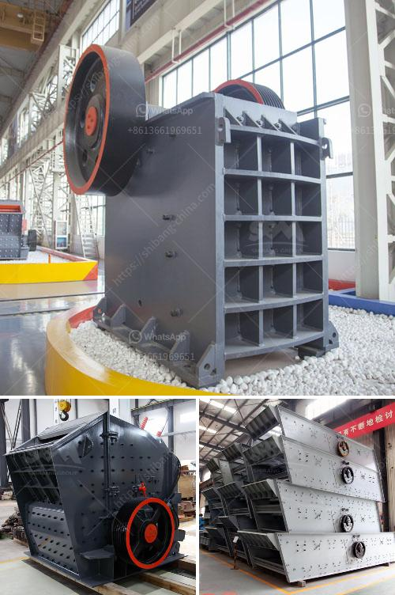

<h3>coal mill pulverizer in thermal power plant</h3>
Coal mill pulverizer in thermal power plants is one of the key components in a thermal power plant. This mill is used to grind and dry coal before it is fed into the boiler. It is also responsible for the pulverization and proper drying of coal in the mill. This means that the coal particles are finely ground and the moisture content is reduced to a level that is suitable for combustion. 

The coal mill pulverizer consists of a complex system of pipes that takes the coal-laden air mixture from the pulverizer and directs it to the boiler. Here, the mixture is ignited in the furnace and the heat generated is used to produce steam, which drives the turbines and generates electricity. 

The pulverizer, as the name suggests, is responsible for pulverizing the coal, turning it into powder form. This is achieved by grinding the coal between rotating rollers and stationary grinding elements. The coal is crushed under high pressure and moves towards the periphery of the mill where it is then swept up by the air and carried into the boiler. 

Proper functioning and performance of the coal mill pulverizer is crucial for the overall efficiency and effectiveness of a thermal power plant. Many factors affect the performance of the pulverizer, including the type of coal used, the moisture content, the size and distribution of the coal particles, and the air flow within the mill. 

It is important to maintain the proper balance between coal and air in the mill to ensure efficient combustion. If there is too much coal and not enough air, the coal particles may not be properly ignited, leading to incomplete combustion and the formation of pollutants such as carbon monoxide. On the other hand, if there is too much air and not enough coal, the combustion may be inefficient, resulting in reduced power output and increased emissions. 

To optimize the performance of the coal mill pulverizer, regular maintenance and inspections are necessary. This includes checking and cleaning the grinding elements, inspecting the wear parts, and ensuring that the coal air mixture is properly balanced. Any issues or problems should be addressed promptly to avoid any disruptions in power generation. 

In conclusion, the coal mill pulverizer plays a crucial role in the overall operation of a thermal power plant. As the key component responsible for grinding and drying the coal, it is important to monitor its performance regularly and make necessary adjustments to ensure that the plant operates at peak efficiency. By maintaining proper balance between coal and air, conducting regular maintenance, and addressing any issues promptly, the coal mill pulverizer can contribute to reliable and efficient power generation.
<h3>Contact us</h3><ul><li><strong>Whatsapp:&nbsp;<a href="https://wa.me/8613661969651">+8613661969651</a></strong></li><li><a href="https://swt.shibang-china.com/?git&amp;zhl&amp;coal mill pulverizer in thermal power plant"><strong>Online Service(chat now)</strong></a></li></ul><h3>Related</h3><ul><li><a href='crusher plants in sri lanka.md'>crusher plants in sri lanka</a></li><li><a href='iron ore crushed machine second hand.md'>iron ore crushed machine second hand</a></li><li><a href='track mobile crusher.md'>track mobile crusher</a></li><li><a href='3 roll mills machine manufacturers in europe.md'>3 roll mills machine manufacturers in europe</a></li><li><a href='conveyor belts malaysia.md'>conveyor belts malaysia</a></li></ul>