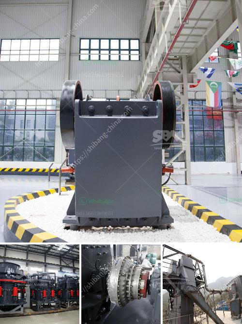

<h3>coal mining plant in ethiopia</h3>
Ethiopia, known for its rich culture and history, is also making significant strides in the field of energy production. One of the key players in this endeavor is the coal mining plant located in the small town of Delbi, in the southwestern part of the country.

Coal, a non-renewable fossil fuel, has long been used as a source of energy worldwide. However, in Ethiopia, it has only recently taken center stage as a potential power source. The Delbi coal mine boasts high-quality coal deposits that contain low levels of sulfur and other impurities, making it an attractive option for electricity generation.

The coal mining plant in Delbi began its operations in 2015 and has since become an important pillar of Ethiopia's energy sector. With an estimated deposit of more than 110 million tons, the mine is expected to have a significant impact on the country's energy mix.

Although Ethiopia is primarily known for its reliance on clean energy sources such as hydroelectric power, the addition of coal into the energy mix offers several advantages. Firstly, it provides energy security, as it diversifies the country's energy sources and reduces dependence on hydroelectricity, which can be affected by droughts. Secondly, coal mining creates job opportunities and boosts the local economy, benefiting the surrounding communities.

However, it is crucial to acknowledge the potential environmental challenges associated with coal mining. The extraction and burning of coal release greenhouse gases, contributing to climate change. Moreover, the mining process can lead to soil, water, and air pollution if not properly regulated and monitored. Therefore, it is imperative for the Ethiopian government and mining companies to prioritize environmental protection measures and invest in clean coal technologies.

In conclusion, the coal mining plant in Ethiopia's Delbi town is a significant development in the country's energy sector. While it offers energy security and economic opportunities, it is imperative to address the environmental concerns associated with coal mining. By implementing strict regulations and investing in clean coal technologies, Ethiopia can harness the benefits of coal while minimizing its negative impact on the environment.
<h3>Contact us</h3><ul><li><strong>Whatsapp:&nbsp;<a href="https://wa.me/8613661969651">+8613661969651</a></strong></li><li><a href="https://swt.shibang-china.com/?git&amp;zhl&amp;coal mining plant in ethiopia"><strong>Online Service(chat now)</strong></a></li></ul><h3>Related</h3><ul><li><a href='for sale prices jaw crushe.md'>for sale prices jaw crushe</a></li><li><a href='100 tonnes crusher for sale south africa.md'>100 tonnes crusher for sale south africa</a></li><li><a href='primary crusher meaning in hindi.md'>primary crusher meaning in hindi</a></li><li><a href='types of belt conveyors used in cement industries.md'>types of belt conveyors used in cement industries</a></li><li><a href='cement clinker grinding mill.md'>cement clinker grinding mill</a></li></ul>