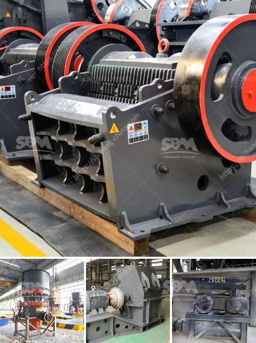

<h3>coal processing equipment</h3>
Coal is one of the world’s most abundant sources of energy, providing electricity and heat to millions of people worldwide. With advancements in technology, coal processing equipment are effective and efficient methods of extracting, processing, and refining coal.

In recent years, the coal mining industry has been transforming to enhance quality and production capabilities and improve the safety of miners. Coal processing equipment is crucial in the industry, enabling preparation and distribution of coal to power plants and industrial facilities. Coal processing equipment is designed to meet international standards and cater to the diverse needs of the coal mining industry.

Coal processing equipment includes crushers, shredders, grinders, mills, classifiers, separators, and dryers, among others. These equipment, when set up properly, are capable of processing coal to the desired specifications. Coal processing equipment ensures optimal utilization of the coal resource and provides high-quality end products.

One of the key equipment used in coal processing is the Dewatering Screen. The Dewatering screen is specifically designed to remove moisture from the coal. It provides great benefits by reducing transportation costs and improving thermal efficiency. The Dewatering screen works by vibrating the coal mixture, separating the water content from the coal particles.

Other important equipment includes crushers and shredders. These machines are responsible for breaking down large chunks of coal into smaller, more manageable pieces. This process increases the surface area of coal, making it easier to burn efficiently. By reducing the size of coal particles, crushers and shredders ensure uniformity in the coal mixture and enhance the overall combustion process.

Overall, coal processing equipment plays a vital role in the coal mining industry. It helps optimize resource utilization, improve the safety of miners, and produce high-quality coal products. With technological advancements and continuous innovation, coal processing equipment is becoming more efficient and effective, contributing to a sustainable and reliable energy source for the world.
<h3>Contact us</h3><ul><li><strong>Whatsapp:&nbsp;<a href="https://wa.me/8613661969651">+8613661969651</a></strong></li><li><a href="https://swt.shibang-china.com/?git&amp;zhl&amp;coal processing equipment"><strong>Online Service(chat now)</strong></a></li></ul><h3>Related</h3><ul><li><a href='gold washer machine manufacturer.md'>gold washer machine manufacturer</a></li><li><a href='graphite ore buyers in india.md'>graphite ore buyers in india</a></li><li><a href='small scale gold milling and processing plant.md'>small scale gold milling and processing plant</a></li><li><a href='pe jaw crusher price list.md'>pe jaw crusher price list</a></li><li><a href='new technology stone crusher in india.md'>new technology stone crusher in india</a></li></ul>