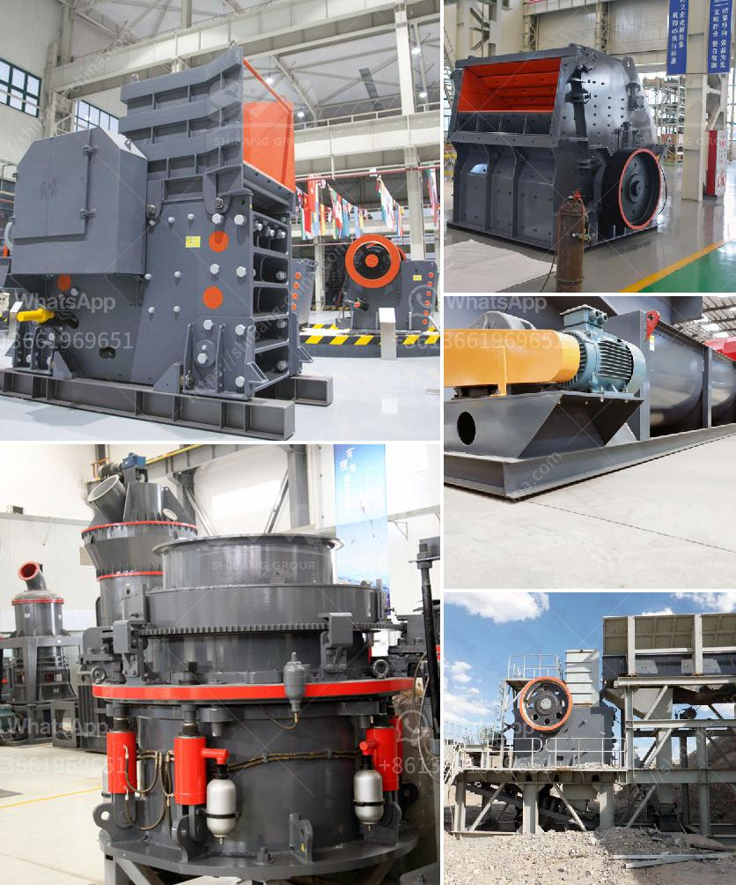

<h3>coal pulverizer machine hammer</h3>
The coal pulverizer machine, also known as a hammer mill or crusher, is a necessary piece of equipment in the mining and utility industries. Coal power plants and thermal power stations alike rely on this machinery to process coal for combustion and ultimately generate electricity.

Coal is a raw material found in abundance in various regions of the world and is a primary fuel source for many industries. It undergoes a series of transformations before it can be used effectively. One crucial step in this process is the pulverization of coal into fine powder. The coal pulverizer machine hammer is responsible for grinding the coal into pulverized fuel before it is blown into the combustion chamber of a boiler furnace.

The pulverization process helps maximize the efficiency of coal combustion and ensures a more thorough and even burn. Pulverized coal has a larger surface area, allowing it to mix more effectively with oxygen in the combustion chamber. This promotes better combustion and produces more heat energy, ultimately leading to higher power generation.

The coal pulverizer machine hammer employs a series of rotating hammers to break and grind the coal into smaller pieces. The hammers act like a series of miniature jackhammers, repeatedly striking the coal, crushing it, and forcing it through a screen at the bottom of the machine. The desired size of the pulverized coal can be adjusted by changing the size of the screen.

To ensure reliable and efficient operation, coal pulverizer machines are built with durable materials and incorporate advanced technologies. The hammers are typically made from high-strength steel, allowing them to withstand the constant impact and grinding forces. The machine is equipped with a powerful motor that drives the hammers and ensures high-speed rotation, enabling efficient pulverization.

Regular maintenance and inspection are essential to ensure the optimal performance of the coal pulverizer machine hammer. The hammers should be inspected regularly for wear and tear. If any hammers are damaged or worn beyond their useful life, they should be replaced promptly to maintain efficient operation.

Efficiency and performance are critical factors when it comes to coal pulverizer machines. The capacity of a machine may vary, depending on its size and design. Higher-capacity machines can process larger quantities of coal, leading to increased power generation. Additionally, some machines are equipped with features like automatic feed controls and variable speed drives, allowing operators to optimize the pulverization process for maximum efficiency.

In conclusion, the coal pulverizer machine hammer plays a crucial role in the pulverization of coal, enabling efficient combustion and power generation. By breaking down coal into fine particles, these machines ensure a more complete burn and maximize energy extraction. With regular maintenance and modern design features, coal pulverizer machines continue to be a vital component of the coal power industry.
<h3>Contact us</h3><ul><li><strong>Whatsapp:&nbsp;<a href="https://wa.me/8613661969651">+8613661969651</a></strong></li><li><a href="https://swt.shibang-china.com/?git&amp;zhl&amp;coal pulverizer machine hammer"><strong>Online Service(chat now)</strong></a></li></ul><h3>Related</h3><ul><li><a href='to buy a coal wash plant in germany.md'>to buy a coal wash plant in germany</a></li><li><a href='dolomite refractory bricks process.md'>dolomite refractory bricks process</a></li><li><a href='stone crushing prices.md'>stone crushing prices</a></li><li><a href='used grinding mill equipment.md'>used grinding mill equipment</a></li><li><a href='gold washing equipment portable.md'>gold washing equipment portable</a></li></ul>