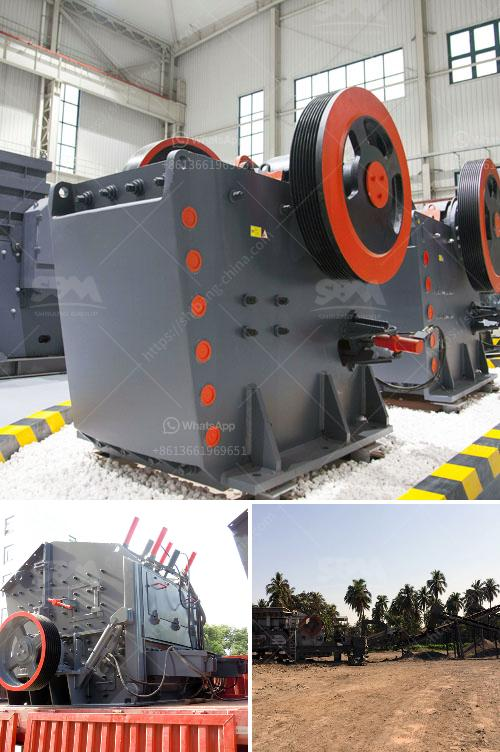

<h3>coal pulverizer machine</h3>
Coal is one of the most abundant energy sources in the world. It has played a crucial role in powering industries, heating homes, and fueling vehicles for decades. However, before it can be used as an energy source, it needs to be transformed into a form that is suitable for combustion. This is where a coal pulverizer machine comes into play.

A coal pulverizer machine is a mechanical device used to pulverize coal for combustion in a furnace. The coal pulverizer is the heart of a power plant, effectively and efficiently converting the energy stored in coal into thermal energy, making it available for combustion. The pulverized coal is then ready for burning in the combustion chamber, generating heat to produce steam which drives turbines and ultimately produces electricity.

The coal pulverizer machine plays a pivotal role in coal-fired power generation plants. The pulverizing process ensures coal particles are uniformly processed for optimal combustion, providing energy efficiency to the boilers that power the turbines. Composed of several major components, the coal pulverizer machine works to produce the desired fineness, shape, and size of coal particles to fuel combustion in the steam-generating furnaces of coal-fired power plants.

One of the key components of the coal pulverizer machine is the bowl mill. This mill is designed for grinding and drying of coal, providing reliable operation and flexibility. The grinding area is made of wear-resistant materials to ensure longer service life and less maintenance. Additionally, the bowl mill features an integral classifier that holds the pulverized coal and separates the particles based on size, allowing proper control of the fuel supply.

Another significant component of the coal pulverizer machine is the coal crusher. Coal crushers play an important role in the production capacity of coal-fired power plants, contributing to the processing capacity of the entire power plant. The coal crusher machine uses a combination of high-wear-resistant materials and crushing mechanisms to ensure efficient and reliable operation.

Additionally, various safety features are integrated into coal pulverizer machines to protect against accidents and ensure the safety of operators and equipment. These safety features include advanced control systems, temperature and pressure sensors, and interlocks that prevent the machine from operating under abnormal conditions. Regular maintenance and inspections, along with trained personnel, are crucial to ensure the proper functioning and reliability of coal pulverizer machines.

In conclusion, coal pulverizer machines are a vital component in coal-fired power generation plants. They help transform raw coal into a form suitable for combustion, ensuring efficient and reliable power production. With the ability to grind, crush, and classify coal particles to the desired fineness, the coal pulverizer machine enables optimal combustion, maximizes energy efficiency, and helps meet environmental regulations. By investing in high-quality coal pulverizer machines and conducting regular maintenance, power plants can ensure the long-term reliability and operational efficiency of their pulverizing systems.
<h3>Contact us</h3><ul><li><strong>Whatsapp:&nbsp;<a href="https://wa.me/8613661969651">+8613661969651</a></strong></li><li><a href="https://swt.shibang-china.com/?git&amp;zhl&amp;coal pulverizer machine"><strong>Online Service(chat now)</strong></a></li></ul><h3>Related</h3><ul><li><a href='screen crusher for sale.md'>screen crusher for sale</a></li><li><a href='jaw crushers for sale in zimbabwe.md'>jaw crushers for sale in zimbabwe</a></li><li><a href='small rock crusher for sale.md'>small rock crusher for sale</a></li><li><a href='rolling ball mills manufacturer.md'>rolling ball mills manufacturer</a></li><li><a href='crusher specification.md'>crusher specification</a></li></ul>