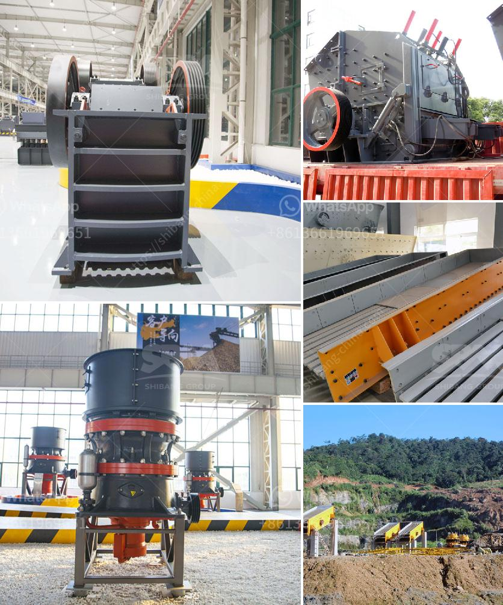

<h3>coal pulverizing mills</h3>
Coal pulverizing mills are devices used to grind coal into a fine powder for combustion in furnaces. Many power plants and industrial facilities rely on these mills to generate heat and electricity. However, coal pulverizing mills can be challenging to operate and maintain due to their complex design and high levels of abrasiveness.

One of the key components of a coal pulverizing mill is the coal pulverizer or coal crusher. The coal crusher uses large amounts of force and impact to break down coal into smaller pieces, resulting in a powdered form suitable for combustion in boilers. These crushers typically operate under extreme conditions, often experiencing high temperatures, vibrations, and frequent start-stop cycles.

To ensure the smooth operation of coal pulverizing mills, regular maintenance is essential. This can include inspecting and replacing worn or damaged parts, such as grinding balls and liners, as well as lubricating bearings and tightening bolts. Failure to carry out proper maintenance can lead to reduced performance, increased downtime, and costly repairs.

Coal pulverizing mills also require regular monitoring and control to optimize their efficiency. It is important to maintain a consistent and uniform coal particle size distribution to ensure efficient combustion. This can be achieved through the use of advanced control systems that monitor grinding conditions and adjust the mill's operating parameters accordingly.

In recent years, there has been a growing focus on the environmental impact of coal-fired power plants. As a result, efforts have been made to improve the efficiency of coal pulverizing mills and reduce emissions. Technologies such as low NOx burners and flue gas desulfurization systems have been implemented to minimize the release of pollutants into the atmosphere.

In conclusion, coal pulverizing mills play a crucial role in the generation of heat and electricity from coal. However, their operation and maintenance can be challenging due to their complex design and abrasive nature. Regular maintenance, proper monitoring, and control are essential to ensure their efficient and reliable operation. Additionally, efforts to improve their efficiency and reduce emissions are ongoing in light of growing environmental concerns.
<h3>Contact us</h3><ul><li><strong>Whatsapp:&nbsp;<a href="https://wa.me/8613661969651">+8613661969651</a></strong></li><li><a href="https://swt.shibang-china.com/?git&amp;zhl&amp;coal pulverizing mills"><strong>Online Service(chat now)</strong></a></li></ul><h3>Related</h3><ul><li><a href='rock crusher alibaba.md'>rock crusher alibaba</a></li><li><a href='the vertical mill ireland information.md'>the vertical mill ireland information</a></li><li><a href='ball mill machine price in india.md'>ball mill machine price in india</a></li><li><a href='latest stone crusher machine price india.md'>latest stone crusher machine price india</a></li><li><a href='jaw crusher private sale south africa.md'>jaw crusher private sale south africa</a></li></ul>