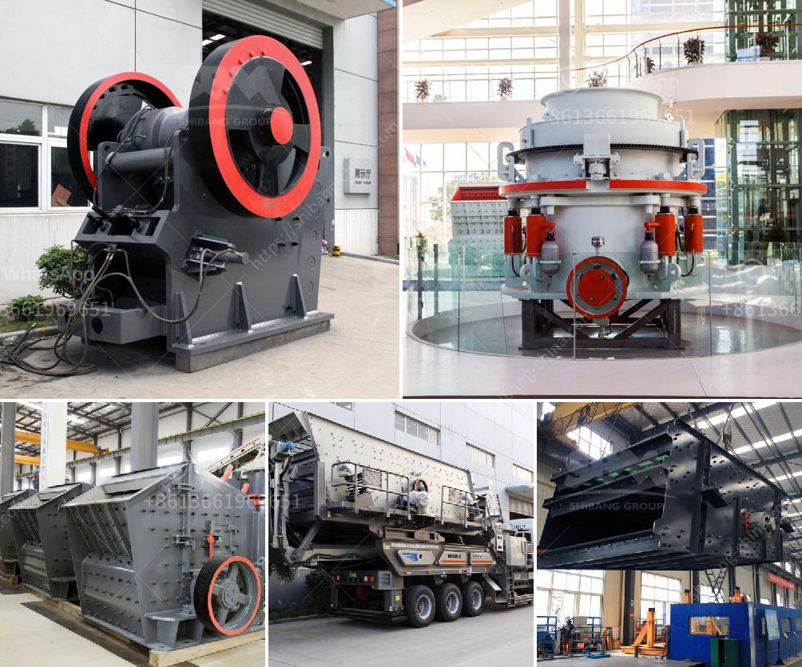

<h3>coal seal of coal pulverizer</h3>
The coal pulverizer is an essential equipment in the coal-fired power plant. The seal of the coal pulverizer plays a crucial role in preventing the coal powder leakage from the equipment. Coal dust is highly explosive and can pose a serious threat to the immediate surroundings. Therefore, the seal of the coal pulverizer needs to be efficient and reliable.

The main purpose of the coal pulverizer seal is to control the coal and air mixture flow rate within the pulverizer and prevent the escape of coal powder particles. It ensures that the coal is fully ground and properly mixed with the air, leading to efficient combustion in the boiler. A well-designed seal also minimizes the amount of unburned carbon in the ash, improving the overall efficiency and reducing environmental emissions.

There are different types of seals used in coal pulverizers, such as labyrinth seal, ring seal, and brush seal. These seals are typically made using abrasion-resistant materials to withstand the harsh operating conditions of the pulverizer. They are also designed to provide a tight seal to prevent any leakage of coal dust.

To ensure the seal's effectiveness, regular inspection and maintenance are essential. The seal should be checked for any signs of wear or damage and replaced if necessary. Moreover, the coal pulverizer should be regularly cleaned to remove any accumulated coal dust that can affect the seal's performance.

Improperly sealed coal pulverizers can significantly impact the efficiency and safety of the coal-fired power plant. Coal powder leakage can lead to a decrease in boiler performance, increased maintenance costs, and potential safety hazards. Therefore, investing in a high-quality and well-maintained seal is crucial for the smooth operation of the power plant.

In conclusion, the seal of the coal pulverizer is a critical component in maintaining the efficiency and safety of a coal-fired power plant. It prevents the leakage of coal powder and ensures the proper combustion of coal in the boiler. Regular inspection and maintenance of the seal are necessary to ensure its effectiveness. By investing in a reliable seal, power plant operators can enhance efficiency, reduce maintenance costs, and mitigate potential safety risks associated with coal dust.
<h3>Contact us</h3><ul><li><strong>Whatsapp:&nbsp;<a href="https://wa.me/8613661969651">+8613661969651</a></strong></li><li><a href="https://swt.shibang-china.com/?git&amp;zhl&amp;coal seal of coal pulverizer"><strong>Online Service(chat now)</strong></a></li></ul><h3>Related</h3><ul><li><a href='mine to mill optimization and reconciliation.md'>mine to mill optimization and reconciliation</a></li><li><a href='grinding tunbe mill and ball mill.md'>grinding tunbe mill and ball mill</a></li><li><a href='process of roll milling.md'>process of roll milling</a></li><li><a href='aggregate crushers for sale.md'>aggregate crushers for sale</a></li><li><a href='conveyor supplier in the philippines.md'>conveyor supplier in the philippines</a></li></ul>