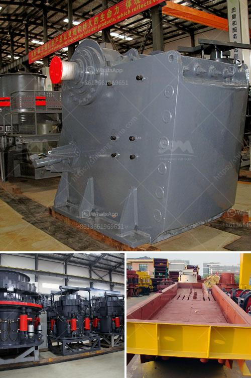

<h3>coal wash plant indonesia</h3>
Coal wash plant in Indonesia is a significant aspect of the country's economy as it helps to meet energy needs while supporting economic growth. Coal, which is primarily used for energy production, is one of the largest export commodities in Indonesia. In 2020, coal exports accounted for $13.4 billion, making it a crucial source of revenue for the country.

A coal wash plant is an essential facility that separates impurities from coal, making it suitable for various industrial applications. The process involves crushing the coal into smaller particles and then subjecting it to various methods such as gravity separation, flotation, and magnetic separation to remove impurities like sulfur, ash, and rock. Ultimately, the clean coal can be used for power generation, steel production, and other industrial uses.

Indonesia has a vast reserve of coal, primarily located in Sumatra, Kalimantan, and Papua. The country's strategic location to major international markets, such as China and India, also makes it an attractive hub for coal production and export. According to the Indonesian Coal Mining Association, Indonesia has an estimated coal reserve of 32 billion tons, with around 70% of it being classified as low-rank coal. This low-rank coal is particularly suitable for use in coal wash plants, as it often contains higher levels of impurities that need to be removed.

The presence of coal wash plants in Indonesia is important not only for the domestic market but also for international customers. Exporting clean coal ensures that the coal meets specific quality standards, enabling it to be used in a wide range of industries. Clean coal is also more environmentally friendly, as it emits fewer pollutants, reducing the impact on air quality and mitigating climate change concerns.

Moreover, coal wash plants play a vital role in maximizing the value of the country's coal resources. By cleaning the coal, impurities are removed, improving its calorific value and enhancing its economic viability. This, in turn, leads to increased revenue for both producers and the Indonesian government, as clean coal tends to fetch higher prices in the global market.

However, it is essential to address the environmental concerns associated with coal wash plants. The process of washing coal generates large volumes of wastewater, which can be harmful if not properly treated. Efforts should be made to ensure that coal wash plants adhere to strict environmental regulations, implementing sustainable practices to minimize water usage and effectively treat wastewater before being discharged into the environment.

Additionally, investing in research and development to improve coal washing technologies can lead to more efficient and cleaner processes. This includes exploring methods for reducing water consumption, optimizing energy usage, and finding innovative ways to handle and dispose of waste materials generated during the coal washing process.

In conclusion, coal wash plants in Indonesia are crucial for meeting both domestic energy demands and international export requirements. The existence of coal wash plants supports economic growth by maximizing the value of the country's coal resources while promoting cleaner and more sustainable coal production. It is essential to balance the economic benefits with environmental considerations by implementing stringent regulations and investing in technological advancements for a more sustainable coal washing industry.
<h3>Contact us</h3><ul><li><strong>Whatsapp:&nbsp;<a href="https://wa.me/8613661969651">+8613661969651</a></strong></li><li><a href="https://swt.shibang-china.com/?git&amp;zhl&amp;coal wash plant indonesia"><strong>Online Service(chat now)</strong></a></li></ul><h3>Related</h3><ul><li><a href='to buy a second hand mobile stone crusher plant india.md'>to buy a second hand mobile stone crusher plant india</a></li><li><a href='chromite ore beneficiation processing.md'>chromite ore beneficiation processing</a></li><li><a href='vibrating screens in italy.md'>vibrating screens in italy</a></li><li><a href='100tpd cement grinding unit cost.md'>100tpd cement grinding unit cost</a></li><li><a href='the estimated cost of setting up a quarry.md'>the estimated cost of setting up a quarry</a></li></ul>