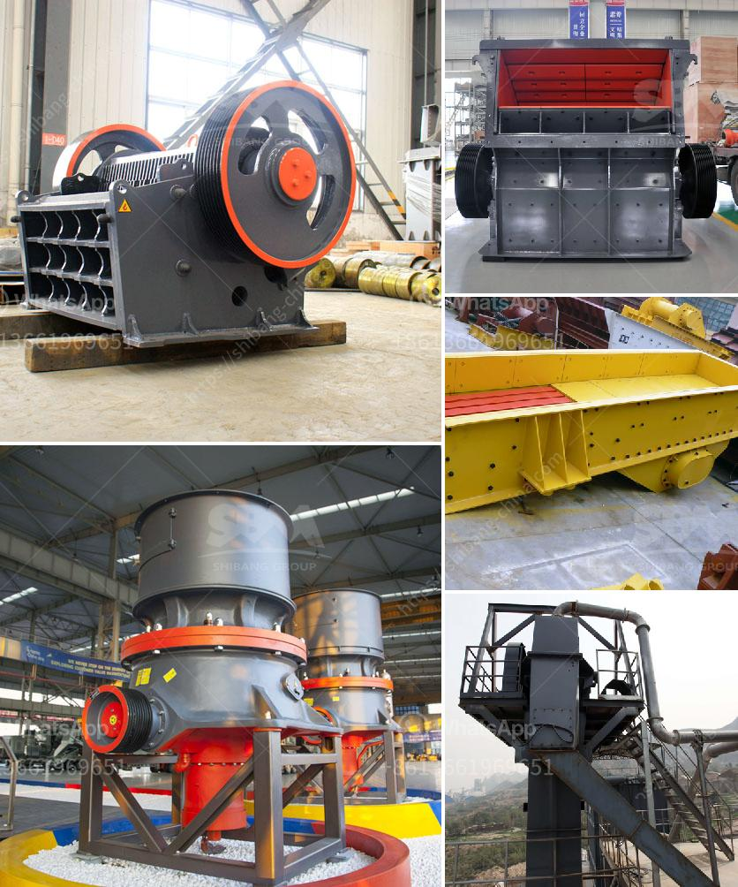

<h3>coal washing plant indonesia</h3>
Coal is one of the world's most valuable resources, providing energy for power generation and industrial production. However, the extraction and utilization of coal come with environmental concerns, particularly related to the release of harmful pollutants into the air and water. To mitigate these issues, coal washing plants have become an integral part of the coal mining industry in many countries, including Indonesia.

Indonesia is a significant player in the global coal market. With abundant coal reserves and increasing demand, the country has witnessed a surge in coal mining activities over the years. However, the country's coal mines often produce low-quality coal, containing impurities such as sulfur, nitrogen, and ash. These impurities not only decrease the heating value of coal but also contribute to environmental pollution.

To address these challenges, Indonesia has adopted the use of coal washing plants. These plants utilize various techniques to remove impurities from coal, increasing its energy content and reducing harmful emissions when it is burned for power generation or other industrial purposes. The most commonly used method is dense media separation, where coal is immersed in a medium that has a higher density than coal, causing impurities to separate and sink.

Coal washing plants in Indonesia work by subjecting the coal to different physical and chemical treatments, depending on the properties of the coal and the desired output specifications. The process typically involves crushing the coal into smaller fragments, water-based separation techniques, and the use of chemicals to remove impurities. Once the coal is cleaned, it can be transported to power plants or industrial facilities, ensuring a cleaner and more efficient combustion process.

The establishment of coal washing plants in Indonesia has several benefits. Firstly, it helps to improve the quality of coal, making it more attractive to international buyers and increasing its market value. Secondly, it reduces the environmental impact of coal mining by minimizing pollutants released into the air and water. Lastly, coal washing plants create job opportunities and foster economic growth in local communities.

Despite the undeniable advantages, challenges remain in the development and operation of coal washing plants in Indonesia. These include the high investment costs, the need for skilled labor, and the lack of appropriate infrastructure in remote mining areas. However, with the growing awareness of environmental issues and the increasing demand for cleaner energy, the Indonesian coal industry is motivated to invest in innovative technologies and processes to ensure sustainable coal mining practices.

In conclusion, coal washing plants in Indonesia play a crucial role in enhancing the value of coal and reducing its environmental impact. By adopting advanced techniques and technologies, these plants contribute to the sustainable development of the country's coal mining industry. As the demand for clean energy continues to rise, coal washing plants will become increasingly significant in ensuring the responsible and efficient use of coal as an essential energy source.
<h3>Contact us</h3><ul><li><strong>Whatsapp:&nbsp;<a href="https://wa.me/8613661969651">+8613661969651</a></strong></li><li><a href="https://swt.shibang-china.com/?git&amp;zhl&amp;coal washing plant indonesia"><strong>Online Service(chat now)</strong></a></li></ul><h3>Related</h3><ul><li><a href='japan mobile stone crusher machine.md'>japan mobile stone crusher machine</a></li><li><a href='silico manganese manufacturing equipment.md'>silico manganese manufacturing equipment</a></li><li><a href='hydro sizing silica sand crusher plant.md'>hydro sizing silica sand crusher plant</a></li><li><a href='using mobile jaw crusher.md'>using mobile jaw crusher</a></li><li><a href='kaolin processing equipment.md'>kaolin processing equipment</a></li></ul>