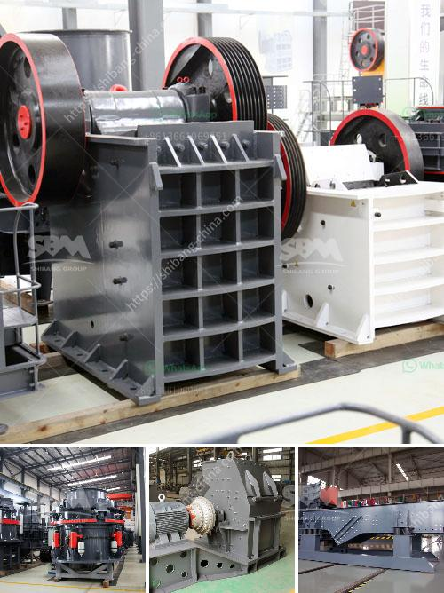

<h3>coal washing plant manufacturers india</h3>
Coal washing is an integral part of the coal production process in most developed countries. Today, it is widely used in thermal power plants as well as in metallurgical, cement, fertilizer, and other industries. Coal washing plant manufacturers India, with names like Spacechem and Coaltronics, have built successful businesses through their ability to support key industries, including the coal mining sector.

Coal washing involves the separation and removal of impurities that are present in raw coal. This process helps to improve the quality of coal, making it more suitable for various applications. Coal washing plants achieve this by using dense medium cyclones, water-only cyclones, spirals, and froth flotation techniques. Through coal washing, plants are able to produce coal with lower ash and sulfur content, which results in reduced emissions when used for energy generation.

In India, rapid economic growth has led to a significant increase in energy consumption, making coal an important part of the energy mix. India is the world's third-largest coal producing country, and coal provides over 70% of the country's energy needs. As a result, there is a growing demand for coal washing plants in the country.

Indian coal washing plant manufacturers have built partnerships with global technology leaders like Allmineral GmbH, Germany and CMTI, MSME-Federal Chamber of Commerce and Industry, South Africa. These collaborations have enabled them to access advanced and efficient technologies that ensure effective coal washing. Moreover, these partnerships have also facilitated the transfer of technical know-how, enabling Indian manufacturers to enhance their expertise and competitiveness.

One notable name in the Indian coal washing plant manufacturing industry is Spacechem Enterprises. With over two decades of experience, Spacechem has achieved a significant reputation by providing customized solutions for coal beneficiation and handling plants. The company offers complete turnkey solutions, including design, engineering, and construction.

Another leading player is Coaltronics, which specializes in coal washing and beneficiation equipment. Coaltronics has a wide range of products, including dense medium cyclones, dewatering screens, belt filters, and centrifuges. They have successfully delivered projects in collaboration with reputed international partners, meeting global quality standards.

Apart from Spacechem and Coaltronics, several other manufacturers in India have established themselves in the coal washing plant industry. These manufacturers have made significant contributions in improving coal quality, reducing emissions, and creating energy-efficient solutions.

The Indian government has also played a crucial role in promoting coal washing plants in the country. Recognizing the environmental benefits, the government has made it mandatory for coal producers to supply washed coal to thermal power plants. This policy has created a favorable environment for manufacturers, encouraging them to invest in coal washing plant infrastructure.

In conclusion, the coal washing plant manufacturing industry in India has grown rapidly, driven by the increasing demand for high-quality coal. Manufacturers like Spacechem and Coaltronics have emerged as key players in this sector, delivering advanced and efficient solutions. With the continued focus on environmental sustainability and energy efficiency, the demand for coal washing plants is likely to grow further, providing ample opportunities for manufacturers in India to thrive.
<h3>Contact us</h3><ul><li><strong>Whatsapp:&nbsp;<a href="https://wa.me/8613661969651">+8613661969651</a></strong></li><li><a href="https://swt.shibang-china.com/?git&amp;zhl&amp;coal washing plant manufacturers india"><strong>Online Service(chat now)</strong></a></li></ul><h3>Related</h3><ul><li><a href='quarries rock crushing process.md'>quarries rock crushing process</a></li><li><a href='second hand jaw crushers in holland.md'>second hand jaw crushers in holland</a></li><li><a href='new technology ball mill factories europe.md'>new technology ball mill factories europe</a></li><li><a href='hammer mill for concentrate price.md'>hammer mill for concentrate price</a></li><li><a href='hammer mill production location in nigeria.md'>hammer mill production location in nigeria</a></li></ul>