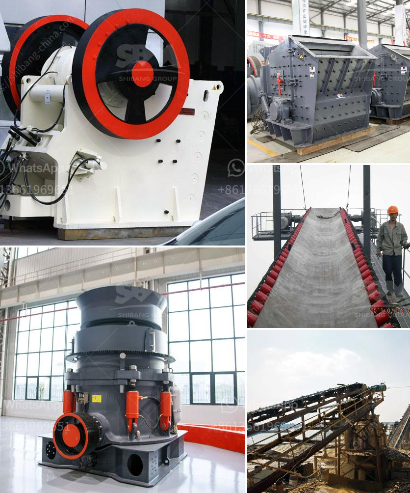

<h3>coal washing process machine</h3>
Coal washing is an essential process for removing impurities such as dust, sulfur, ash, and rock substances from coal to meet the demand for clean coal fuel. With the use of water, coal washing methods clean the coal surface while minimizing the introduction of contaminants into the coal stream.

Coal washing treatment involves many steps. The first step is to remove small particles of coal and rock from the coal stream through a process called screening. Screening separates coal into varying sizes, enabling it to be separated more effectively. The next step is coal washing itself. This process involves immersing the coal in a solution of water and chemicals or by mechanical means such as using gravity or dense medium separation (DMS).

One popular coal washing method is dense medium separation. In this method, the raw coal is crushed and mixed with a medium such as magnetite or fine coal to form a suspension known as a dense medium. The suspension is then fed into a cyclone, where the heavier coal particles sink to the bottom while the lighter particles are carried upward. Water is used to maintain a stable suspension during the entire process.

Another common coal washing method is jigging. Jigging relies on the difference in density between coal and impurities. The raw coal is fed into a jigging machine, which pulsates water through a bed of coal, causing the coal to stratify according to its density. The higher density coal settles on the bottom, while the lower density impurities are carried away by the water. Jigging is particularly effective for treating coal with a high concentration of impurities.

After the coal has been washed, it is dewatered to reduce moisture content. Dewatering can be done through various methods, including vacuum filters, centrifuges, and thermal dryers. Removing excess moisture is crucial as it improves the heating value of the coal and reduces transportation costs.

Overall, the coal washing process machine plays a vital role in ensuring the production of cleaner coal for energy generation. By removing impurities like dust, sulfur, ash, and rock substances, coal washing improves the quality of the final product. It not only enhances the heating value of coal but also minimizes harmful emissions during combustion.

Coal washing also has environmental benefits. By reducing the amount of impurities in coal, the process helps to lower sulfur dioxide (SO2) emissions. SO2 is a major contributor to air pollution, leading to acid rain and respiratory problems. Therefore, coal washing not only benefits the coal industry but also contributes to a cleaner and healthier environment.

In conclusion, the coal washing process machine is a crucial component in coal preparation and purification. Through screening, dense medium separation, jigging, and dewatering processes, it removes impurities and improves the overall quality of coal. This not only enhances the efficiency of coal combustion but also reduces harmful emissions, making it an indispensable technology in the coal industry.
<h3>Contact us</h3><ul><li><strong>Whatsapp:&nbsp;<a href="https://wa.me/8613661969651">+8613661969651</a></strong></li><li><a href="https://swt.shibang-china.com/?git&amp;zhl&amp;coal washing process machine"><strong>Online Service(chat now)</strong></a></li></ul><h3>Related</h3><ul><li><a href='conveyor belts in peru.md'>conveyor belts in peru</a></li><li><a href='copper ore processing.md'>copper ore processing</a></li><li><a href='iron ore mining cost breakdown.md'>iron ore mining cost breakdown</a></li><li><a href='gold ore processing equipment manufacturer.md'>gold ore processing equipment manufacturer</a></li><li><a href='basalt beneficiation process.md'>basalt beneficiation process</a></li></ul>