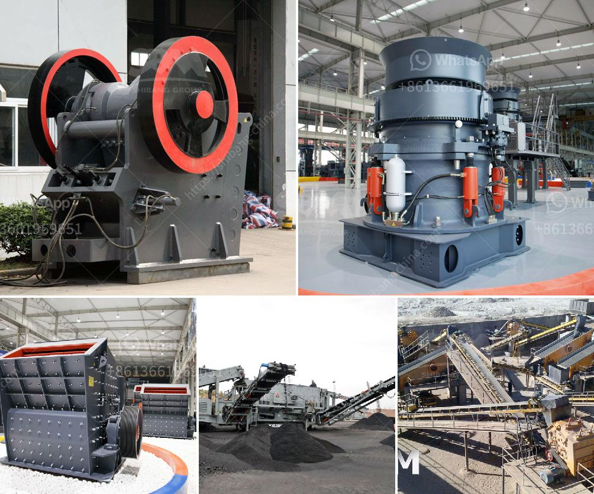

<h3>coal washing processing plant india manufacturer</h3>
Coal washing is a crucial step in the coal mining process as raw coal is mined from underground seams and is thenTsent to a coal processing plant to clean and process the coal. Washing the coal helps to remove impurities and minerals, improving its quality and value for use in different industries.

In India, coal is one of the most abundant and widely used sources of energy. With a large demand for coal from industries such as power generation, cement production, and steel manufacturing, it is essential to have efficient coal washing processing plants that can meet this demand and produce high-quality coal.

One of the leading manufacturers of coal washing processing plants in India is (insert name of the manufacturer). With a strong reputation for delivering reliable and durable plants, they specialize in designing and manufacturing custom-built plants tailored to the specific requirements of the coal mines.

Their coal washing processing plants incorporate various processes like screening, separation, flotation, and dewatering to ensure the removal of impurities and achieve the desired coal quality. Advanced technologies and equipment are used in these plants to maximize efficiency and minimize environmental impact.

The manufacturer offers a range of plant sizes, catering to different production capacities ranging from 100 to 300 tons per hour. The plants are designed to be compact and modular, allowing for easy transportation, installation, and expansion as per the mine's needs.

Apart from the manufacturing of coal washing plants, the company also provides comprehensive after-sales services, including training, maintenance, and troubleshooting support. This ensures that the plants continue to operate efficiently and produce high-quality coal over their lifespan.

With their commitment to quality, reliability, and customer satisfaction, (insert name of the manufacturer) has become a trusted name in the coal washing processing plant industry in India.

In conclusion, coal washing plays a vital role in improving the quality of coal used in various industries, and a reliable and efficient coal washing processing plant is crucial for meeting India's increasing demand for coal. Manufacturers like (insert name of the manufacturer) are dedicated to providing customized plants that enhance coal quality while adhering to environmental standards.
<h3>Contact us</h3><ul><li><strong>Whatsapp:&nbsp;<a href="https://wa.me/8613661969651">+8613661969651</a></strong></li><li><a href="https://swt.shibang-china.com/?git&amp;zhl&amp;coal washing processing plant india manufacturer"><strong>Online Service(chat now)</strong></a></li></ul><h3>Related</h3><ul><li><a href='crusher business aggregate.md'>crusher business aggregate</a></li><li><a href='new generation of hammer mill.md'>new generation of hammer mill</a></li><li><a href='jaw crushers for sale in zimbabwe.md'>jaw crushers for sale in zimbabwe</a></li><li><a href='dolomite rock crusher.md'>dolomite rock crusher</a></li><li><a href='used gold washing machines.md'>used gold washing machines</a></li></ul>