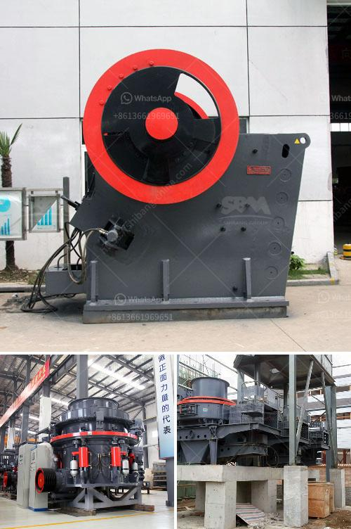

<h3>companies of roller mills</h3>
Roller mills are an essential piece of equipment in the industrial milling industry. These mills are used to pulverize various materials into fine powders, enabling them to be easily processed and utilized in various applications. With a wide range of companies producing roller mills, it can be overwhelming to choose the right one for your specific needs. In this article, we will explore some prominent companies that manufacture roller mills.

One prominent company in this industry is XYZ Roller Mills. With over 50 years of experience, XYZ has established itself as a leader in the production of roller mills. Their state-of-the-art facilities and cutting-edge technology ensure efficient and reliable performance. XYZ Roller Mills offers a wide range of models suitable for different industries and applications. From the food industry to the pharmaceutical sector, XYZ's roller mills have proved their worth time and again.

Another notable name in the roller mill industry is ABC Milling Solutions. With a focus on innovation and quality, ABC has earned a solid reputation among its competitors. Their roller mills are known for their robust construction, durability, and precision performance. ABC Milling Solutions offers a comprehensive range of roller mills designed to cater to the needs of various industries, such as agriculture, chemicals, and minerals processing.

One should not overlook the contributions of PQR Machinery to the roller mill market. PQR has been delivering reliable and high-performance roller mills for over 30 years. Their commitment to customer satisfaction and continuous improvement is evident in the quality of their products. PQR Machinery offers roller mills that are known for their energy efficiency, ease of maintenance, and versatility. Whether you need a roller mill for grinding, crushing, or mixing, PQR Machinery has a solution for you.

In conclusion, when it comes to roller mills, there are several companies that stand out for their high-quality products and excellent customer service. XYZ Roller Mills, ABC Milling Solutions, and PQR Machinery are just a few examples of companies that have made significant contributions to this industry. It is essential to consider your specific needs and requirements when selecting a roller mill, and these companies can provide reliable and efficient solutions for a wide range of applications.
<h3>Contact us</h3><ul><li><strong>Whatsapp:&nbsp;<a href="https://wa.me/8613661969651">+8613661969651</a></strong></li><li><a href="https://swt.shibang-china.com/?git&amp;zhl&amp;companies of roller mills"><strong>Online Service(chat now)</strong></a></li></ul><h3>Related</h3><ul><li><a href='hammer mills for stone.md'>hammer mills for stone</a></li><li><a href='kaolin crusher production costs.md'>kaolin crusher production costs</a></li><li><a href='ball mills for mining price.md'>ball mills for mining price</a></li><li><a href='how much is a crusher.md'>how much is a crusher</a></li><li><a href='manufactures mineral crusher oruro bolivia.md'>manufactures mineral crusher oruro bolivia</a></li></ul>