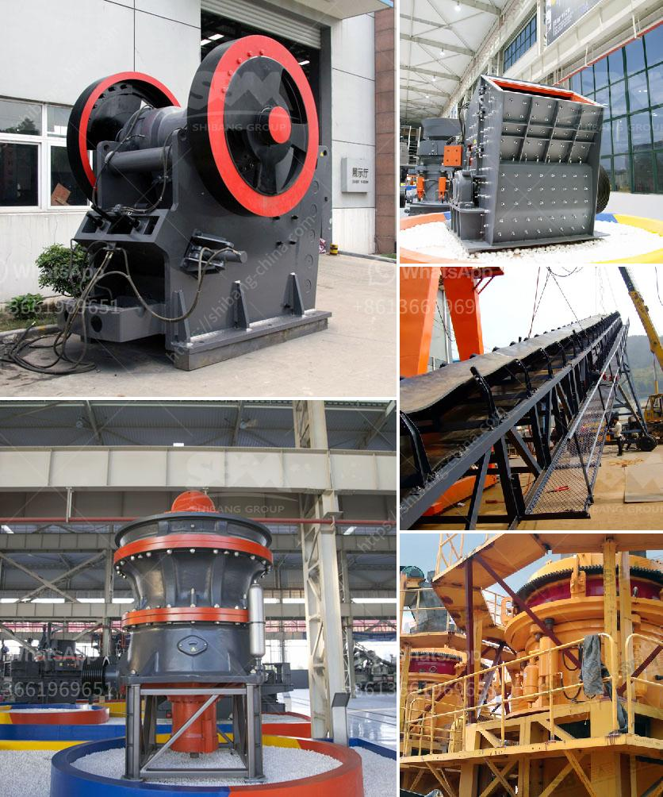

<h3>company mobile crushers</h3>
In recent years, the demand for mobile crushers has been increasing steadily. With advancements in technology, these crushers have made it possible to process materials on-site, which eliminates the need for transportation of the materials to and from the construction site. This has not only reduced costs but also improved efficiency and productivity at construction sites.

One company that has been at the forefront of producing and providing mobile crushers is XYZ Company. With their innovative approach and user-friendly designs, they have revolutionized the industry. Their range of crushers has been designed to cater to the diverse needs of various industries, including construction, mining, and recycling.

A key feature of XYZ Company's crushers is their mobility. These crushers can be easily transported from one site to another, making them ideal for projects that require frequent relocation. This flexibility ensures that construction projects can be completed in a timely manner, without any unnecessary delays caused by transportation issues.

Furthermore, XYZ Company's mobile crushers are equipped with cutting-edge technology, making them efficient and reliable. Advanced features, such as remote control operation and automatic feeding systems, enable operators to control the crushers from a safe distance. This not only ensures the safety of the operators but also enhances productivity by minimizing downtime.

Another advantage of XYZ Company's crushers is their ability to process a wide range of materials. Whether it is concrete, asphalt, rock, or demolition debris, these crushers can handle it all. This versatility makes them a valuable asset on construction sites, as they can process materials on-site, eliminating the need for additional machinery and reducing overall costs.

Moreover, XYZ Company's crushers are designed with sustainability in mind. They are equipped with fuel-efficient engines, which significantly reduces fuel consumption and carbon emissions. This aligns with the global push towards a greener and cleaner environment, making these crushers an eco-friendly choice for construction projects.

In addition to their excellent range of crushers, XYZ Company also offers exceptional after-sales services. Their dedicated team of technicians provides prompt assistance, ensuring that any issues or concerns are resolved quickly. This commitment to customer satisfaction sets XYZ Company apart from its competitors and reinforces their reputation as a reliable and trustworthy provider of mobile crushers.

In conclusion, XYZ Company has established itself as a leader in the mobile crusher industry. Their range of crushers offers mobility, efficiency, and versatility, making them an invaluable asset on construction sites. With their focus on sustainable and eco-friendly solutions, XYZ Company is not only meeting the demands of the market but also contributing to a greener future. If you are in need of mobile crushers for your construction projects, XYZ Company is undoubtedly the go-to choice.
<h3>Contact us</h3><ul><li><strong>Whatsapp:&nbsp;<a href="https://wa.me/8613661969651">+8613661969651</a></strong></li><li><a href="https://swt.shibang-china.com/?git&amp;zhl&amp;company mobile crushers"><strong>Online Service(chat now)</strong></a></li></ul><h3>Related</h3><ul><li><a href='mini concrete crusher portable for rent.md'>mini concrete crusher portable for rent</a></li><li><a href='industrial mill and prices.md'>industrial mill and prices</a></li><li><a href='mobile stone crushers south africa.md'>mobile stone crushers south africa</a></li><li><a href='sells hammer mills in zimbabwe.md'>sells hammer mills in zimbabwe</a></li><li><a href='basalt processing line.md'>basalt processing line</a></li></ul>