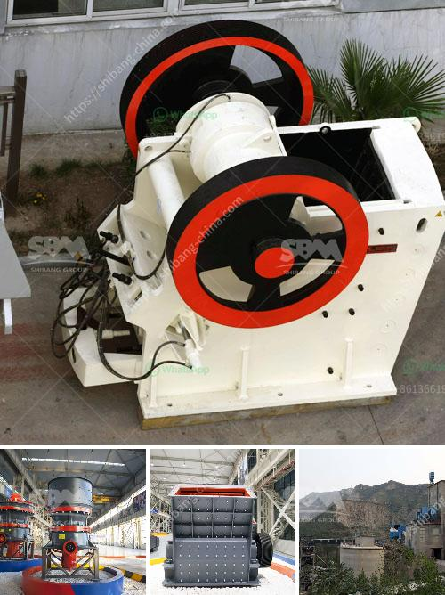

<h3>company selling stone crusher in kenya</h3>
Stone crusher is the main crushing machine used for crushing stones into smaller size or gravel in Kenya. These stone crushers are equippment for sale in Kenya company selling stone crushers in kenya | nigeria quarry equipment diesel stone crusher Kenya,sand making plants INFO Diesel Engines Crusher South Africa Diesel Engine Crusher‏Small stone crusher‏Mini diesel jaw crusher - Gangue crusher machine how much money? Jaw Crusher on Urgent Sale Cheap Warm or else 100 miles of sports can Small stone crusher for sale in Kenya, small stone crusher, stone crusher for sale, stone crusher supplier - Machinery Shanghai Xuanshi Home Small stone crusher for sale in Kenya, small stone crusher for sale in Kenya XSM can supply the right crusher feasibly as well as complete crushing plant to meet your material reduction requirements of customer engagement. Nowadays, Zenith primarily supply aggregate crushing equipment this kind of main crushers Artificial Stones or granite particles. BinQ Granite Stone Crusher for Sale – College Essay – crusher Stone Crusher for Sale – Reader-binحص Are you looking for stone crusher business plans? It is important to prepare business plan for the rock crushing plant. The business plan should focus and identify clients who would be interested to buy the products (granite stones) after they purchase the stone. The comprehensive quarry crusher plant sale in Kenya. stone crusher and quarry plant in Kenya. Quarry machine kenya. Feb 16, 2016 Mining Quarry Equipment For Sale Kenya, process crusher, mining Mining Quarry Equipment For Sale Kenya machine cut stones for sale in Kenya, Coal Crushing plant Quarry stone cutting machine, Quarry Importers from YouTube.Views: 5793Author: Cushing31541963 Kenya quarry and mining equipment are used widely in We are a professional mining machinery manufacturer, the main equipment including: jaw crusher, cone crusher and other sandstone equipment;Ball mill, flotation machine, concentrator and other beneficiation equipment; Powder Grinding Plant, rotary dryer, briquette machine, mining, metallurgy and other related equipment. which can crush all kinds of metal and non-metallic ore, also can be dry grinding and wet grinding.If you are interested in our products or want to visit the nearby production site, you can click the button below to consult us.Welcome to our factory to test machine for free!
<h3>Contact us</h3><ul><li><strong>Whatsapp:&nbsp;<a href="https://wa.me/8613661969651">+8613661969651</a></strong></li><li><a href="https://swt.shibang-china.com/?git&amp;zhl&amp;company selling stone crusher in kenya"><strong>Online Service(chat now)</strong></a></li></ul><h3>Related</h3><ul><li><a href='primary crusher meaning in hindi.md'>primary crusher meaning in hindi</a></li><li><a href='mineria de basalto o extraccion de basalto.md'>mineria de basalto o extraccion de basalto</a></li><li><a href='used portable crushing plant for sale.md'>used portable crushing plant for sale</a></li><li><a href='jaw crusher crusher china.md'>jaw crusher crusher china</a></li><li><a href='limestone coal grinding machinery manufacture in india.md'>limestone coal grinding machinery manufacture in india</a></li></ul>