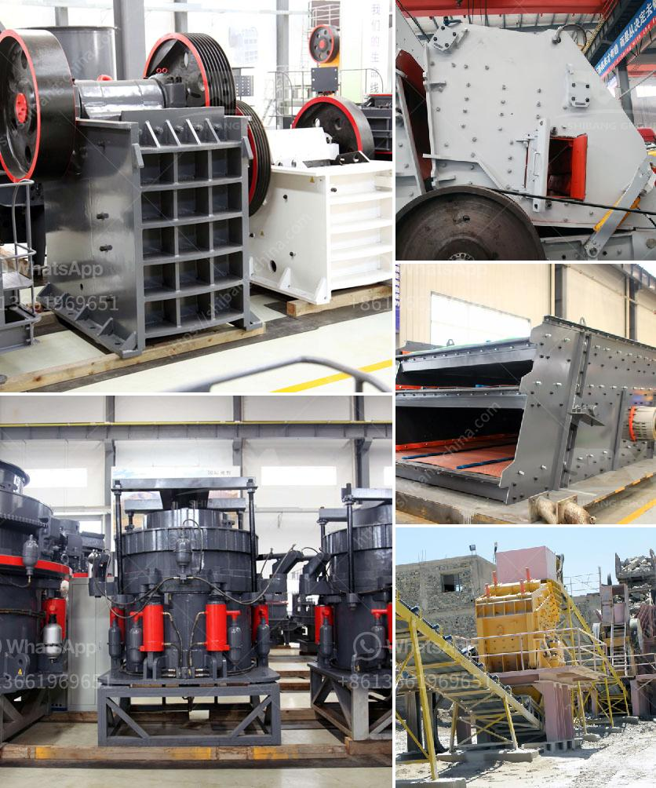

<h3>complete mining equipment in accra ghana</h3>
Ghana is known for its rich natural resources, making it a prime destination for mining companies from all around the world. Accra, the capital city of Ghana, has become a significant hub for the mining industry, attracting investors and mining companies alike. To support these companies in their operations, Accra offers a range of complete mining equipment, ensuring smooth and efficient mining activities.

When it comes to mining equipment, Ghana has various suppliers and manufacturers who provide a wide array of machinery suitable for different mining operations. From exploration to extraction, these equipment suppliers in Accra offer a comprehensive selection of tools and machinery necessary for successful mining.

One category of mining equipment commonly found in Accra is the drilling equipment. Drill rigs are essential for the exploration and evaluation of potential mining sites. These robust machines are used to create boreholes, allowing researchers to gather crucial data about the location's geology and mineral potential. Accra-based suppliers offer a variety of drilling rigs, from smaller, portable units suitable for surface drilling to large-scale rigs used for deeper operations.

Accra is also a reliable source for heavy machinery needed to extract minerals from the ground. Excavators and loaders are commonly used in mining to remove overburden, transport materials, and load ore into trucks. These machines come in various sizes to accommodate different mining site requirements. Accra-based suppliers offer both new and used excavators and loaders, ensuring that mining companies can find equipment that fits their budget and needs.

Furthermore, complete mining equipment in Accra also includes crushing and grinding machinery. After the extraction process, the minerals need to be crushed into smaller sizes for further processing. Crushers and mills are used to break down larger chunks of ore into manageable pieces. Accra provides access to a range of crushers and mills suitable for different minerals. These machines vary in size and capacity, allowing mining companies to find the right equipment for their specific requirements.

Accra's suppliers also offer various ancillary equipment necessary for a smooth mining operation. This includes conveyor belts for efficient material transportation, thickening and filtering equipment for processing, and pumps for dewatering mining sites. The comprehensive range of ancillary equipment available in Accra ensures that mining companies can source all their needs from a single location, saving both time and resources.

In conclusion, Accra, Ghana, serves as a reliable and efficient hub for complete mining equipment. Mining companies and investors looking to establish or expand their operations can find a wide variety of machinery and tools suitable for different mining activities. From drilling rigs to heavy machinery for extraction, as well as crushing and grinding equipment, Accra suppliers offer a comprehensive range of mining equipment. This allows mining companies in Ghana to access the necessary equipment in one location, saving them time and resources in sourcing their requirements elsewhere. With the availability of complete mining equipment in Accra, Ghana is well-positioned to continue attracting mining industry investments for its rich natural resources.
<h3>Contact us</h3><ul><li><strong>Whatsapp:&nbsp;<a href="https://wa.me/8613661969651">+8613661969651</a></strong></li><li><a href="https://swt.shibang-china.com/?git&amp;zhl&amp;complete mining equipment in accra ghana"><strong>Online Service(chat now)</strong></a></li></ul><h3>Related</h3><ul><li><a href='crushing of calcined bauxite.md'>crushing of calcined bauxite</a></li><li><a href='quarry plant equipment.md'>quarry plant equipment</a></li><li><a href='how much is scm series ultrafine mill machine in usa.md'>how much is scm series ultrafine mill machine in usa</a></li><li><a href='used crusher for sale sell buy.md'>used crusher for sale sell buy</a></li><li><a href='south africa gold processing equipment.md'>south africa gold processing equipment</a></li></ul>