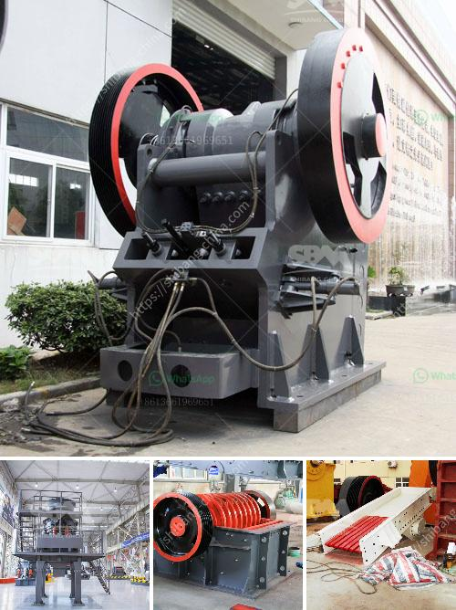

<h3>complete stone crushering plant shanghai</h3>
Stone crushing plants can be found in various corners of the world, but Shanghai has consistently been the leading name in providing complete solutions for efficient stone crushing operations. Our aim is to help businesses increase profitability and productivity by providing the best technology and quality available. The crushing line manufactured by us has more than meets the eye, ensuring zero defects in the final product.

Our complete stone crushing plant machine is equipped with advanced technology and innovative solutions. With 20 years of experience, we have been able to anticipate the demands of our customers and align our offerings accordingly. Our wide range of products includes jaw crushers, cone crushers, vertical shaft impact crushers, feeders, vibrating screens, sand washers, mobile crushing plants, and more. These high-quality machines are manufactured using the latest technology and sourced from reliable suppliers.

Our stone crushing plant is designed to crush hard rocks and aggregates from 80mm down to 0-5mm, 5-10mm, 10-20mm, and 20-40mm in size. This base plant can produce 3 different sizes of stone in one single plant, depending on your requirements. The final products are used as road and railway materials, aggregates for construction or concrete production, and other construction materials.

The stone crushing plant can be used in artificial sand production to produce mechanical sand and stone materials, which can be used for bridge construction, highway construction, urban construction, large-scale water conservancy projects, and other infrastructure constructions. The mobile crushing plant is equipped with the impact crusher and vibrating screen, vibrating feeder, conveyor belt, etc. Mobile impact crushing plant can directly be driven to the site by using a track. As for the stone crushing plant, it is also suitable for the production line.

With the help of the experienced engineers in Shanghai, we have established a complete set of machine manufacturers and assist customers in full-scale production line design and planning. Our professional technicians provide on-site installation and debugging services, as well as afterwards technical support.

In conclusion, Shanghai offers a comprehensive range of stone crushing plants to meet customers' needs. We provide high-quality products, advanced technology, and professional services. We are committed to delivering complete solutions for stone crushing plants, ensuring maximum efficiency, profitability, and quality. Trust Shanghai for your stone crushing needs and witness the difference our products and services can make.
<h3>Contact us</h3><ul><li><strong>Whatsapp:&nbsp;<a href="https://wa.me/8613661969651">+8613661969651</a></strong></li><li><a href="https://swt.shibang-china.com/?git&amp;zhl&amp;complete stone crushering plant shanghai"><strong>Online Service(chat now)</strong></a></li></ul><h3>Related</h3><ul><li><a href='200 ton crusher price.md'>200 ton crusher price</a></li><li><a href='consultants to help to start a stone crusher.md'>consultants to help to start a stone crusher</a></li><li><a href='sand washing machine cost.md'>sand washing machine cost</a></li><li><a href='track mounted crushers.md'>track mounted crushers</a></li><li><a href='sample method statement stone crushing.md'>sample method statement stone crushing</a></li></ul>