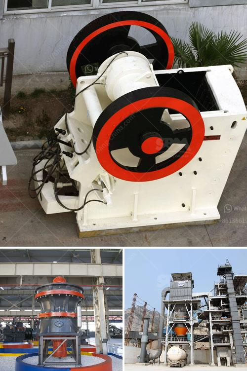

<h3>complete stone processing equipment stone crusher 100tph</h3>
Stone processing equipment is widely used in the crushing and processing of various materials, such as granite, limestone, marble, and quartz sand. Different types of crushers have different operating principles and crushing characteristics, and various crushers are needed in different crushing stages. The stone crusher 100tph is the most common equipment for stone processing, which adopts the principle of squeezing and bending to crush the material.

The stone crusher 100tph is composed of a main frame, an eccentric shaft, a large pulley, a flywheel, a side guard, a toggle plate, a toggle plate rear seat, a clearance adjustment screw, a return spring, a fixed jaw plate, and a movable jawplate. The 100tph stone crusher uses a motor as the power source. The motor drives the belt and pulley to move the movable jaw up and down through the eccentric shaft. When the movable jaw rises, the angle between the toggle plate and the movable jaw becomes larger, which pushes the movable jaw plate to approach the fixed jaw plate. Then, the material is crushed, rubbed and ground multiple times in the crushing cavity, and the broken material is discharged from the lower discharge opening.

The 100tph stone crusher has a wide range of applications, such as mining, metallurgy, building materials, highways, railways, water conservancy, chemical industry, and other industries. It is suitable for various materials with compressive strength less than 320MPa. The stone crusher 100tph can crush large stones into smaller stones (rock particles), gravel, sand, and even finer powder. It is widely used in infrastructure construction, road paving, building materials industry, and mining industry.

The 100tph stone crusher has the advantages of simple structure, large crushing ratio, low energy consumption, high output, uniform product size, good product shape, etc. It is an ideal choice for primary crushing equipment. In addition, the stone crusher 100tph has a small size, compact structure, and convenient operation, which makes it suitable for small-scale production lines or projects with limited space.

To better meet the needs of customers, stone processing equipment manufacturers have introduced various types of stone crushers with different specifications and models. In addition to the 100tph stone crusher, there are also 150tph, 200tph, 300tph, and other large-scale stone crushers available in the market. Customers can choose the appropriate type of stone crusher according to their actual needs and production requirements.

In conclusion, complete stone processing equipment, especially the stone crusher 100tph, has become the mainstream equipment in the stone processing industry due to its simple structure, high crushing efficiency, low operating cost, and wide range of applications. It plays a crucial role in the construction of infrastructure projects and the development of the mining industry. With the continuous improvement of stone processing equipment and the optimization of crushing technology, stone crushers will bring more benefits and create more value for the stone processing industry.
<h3>Contact us</h3><ul><li><strong>Whatsapp:&nbsp;<a href="https://wa.me/8613661969651">+8613661969651</a></strong></li><li><a href="https://swt.shibang-china.com/?git&amp;zhl&amp;complete stone processing equipment stone crusher 100tph"><strong>Online Service(chat now)</strong></a></li></ul><h3>Related</h3><ul><li><a href='sri lankan building sand price.md'>sri lankan building sand price</a></li><li><a href='ball mill in work.md'>ball mill in work</a></li><li><a href='mobile stone crushing machine for sale.md'>mobile stone crushing machine for sale</a></li><li><a href='second hand jaw crushers in holland.md'>second hand jaw crushers in holland</a></li><li><a href='cost of grinding mill.md'>cost of grinding mill</a></li></ul>