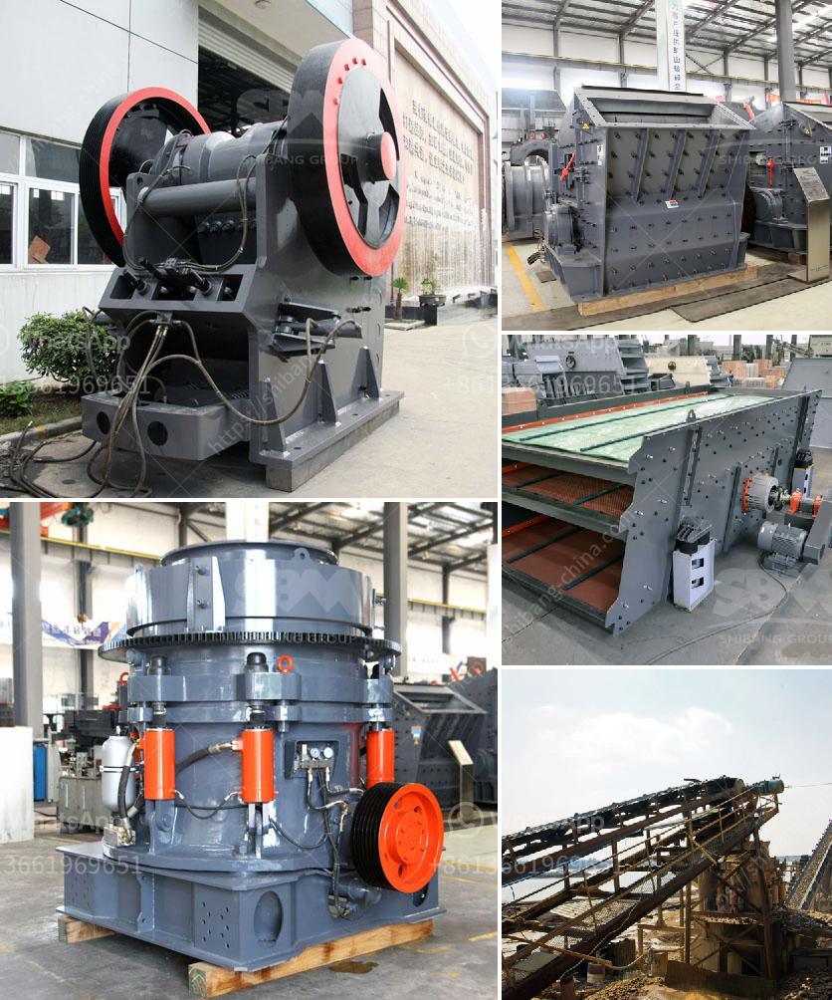

<h3>concrete and stone crushing machines in kenya</h3>
As a trusted crushing plant manufacturer, we have been servicing the industrial and mining industry for over a century. With our in-depth knowledge and experience, we understand the unique needs of our customers in Kenya and offer them quality products and services.

To meet the growing demand for concrete and stone products, we have also invested in modern technology and machinery. We have specifically designed crushers and screeners that are suitable for processing various materials such as cement, concrete, bricks, stones, and mortar. Our machines are durable and efficient, capable of crushing even the toughest materials.

One of the primary advantages of using our concrete and stone crushing machines in Kenya is that they are mobile. This means you can easily transport them to different construction sites, saving time and money. The flexibility of our machines also allows you to reuse materials on-site, reducing waste and environmental impact.

Another key feature of our machines is their strong energy efficiency. We have equipped our crushers with powerful engines that require less fuel, making them cost-effective to operate. This is especially important in Kenya, where electricity costs are high and availability can be limited. By using our machines, construction companies can save on energy bills while achieving their production goals.

Our concrete and stone crushing machines are also equipped with advanced safety features to ensure the operators' wellbeing. These features include emergency stop buttons, safety guards, and integrated dust suppression systems. We prioritize the safety of our customers and provide comprehensive training on the proper use and maintenance of our machines.

In addition to their primary function of crushing concrete and stones, our machines can also be used for recycling purposes. By processing and reusing construction waste, we contribute to a greener environment and reduce the need for raw materials. This is particularly important in Kenya, where sustainable building practices are gaining traction.

As a responsible manufacturer, we understand that reliable after-sales service is crucial. Our team of technicians is always available to provide timely assistance and support. Whether you need advice on machine operation or require spare parts, we are here to help. We believe in building long-term relationships with our customers and are committed to their success.

In conclusion, our concrete and stone crushing machines in Kenya are suitable for processing various materials and have many advantages. They are mobile, energy-efficient, and equipped with advanced safety features. By using our machines, construction companies can save on costs, reduce waste, and contribute to a more sustainable future. Contact us today to learn more about our products and services.
<h3>Contact us</h3><ul><li><strong>Whatsapp:&nbsp;<a href="https://wa.me/8613661969651">+8613661969651</a></strong></li><li><a href="https://swt.shibang-china.com/?git&amp;zhl&amp;concrete and stone crushing machines in kenya"><strong>Online Service(chat now)</strong></a></li></ul><h3>Related</h3><ul><li><a href='sales of conveyor belts.md'>sales of conveyor belts</a></li><li><a href='canber de broage ciment.md'>canber de broage ciment</a></li><li><a href='traditional crushing machine.md'>traditional crushing machine</a></li><li><a href='machines for quarrying of stones.md'>machines for quarrying of stones</a></li><li><a href='crusher in pakistan.md'>crusher in pakistan</a></li></ul>