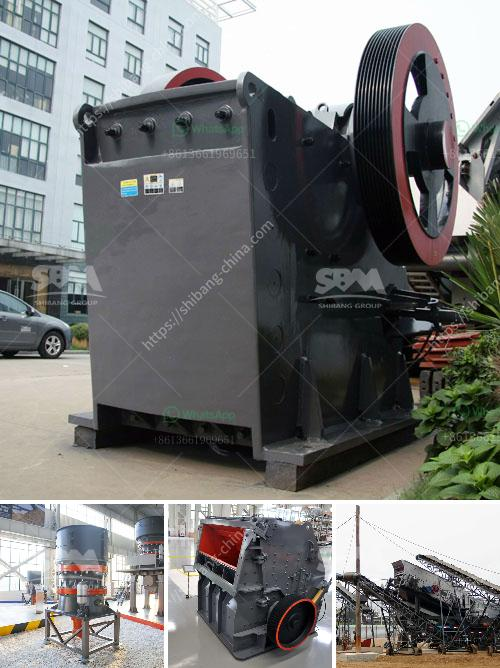

<h3>concrete crusher cost</h3>
Concrete is an essential material for modern construction. The demand for concrete is constantly increasing due to its durability and versatility. However, the process of demolishing and recycling concrete is costly and requires specialized machinery, such as concrete crushers.

Concrete crushers are heavy-duty machines that crush large pieces of concrete into smaller stones or gravel. These machines are specifically designed to handle tough materials like concrete. They also reduce the size of the concrete pieces, thus making transportation easier and more efficient.

The cost of concrete crushers varies depending on the capacity, size, and the materials being crushed. The average cost is around $200 per hour for a 10-30 tonne mobile crusher that produces between 15-50 tonnes of crushed concrete per hour. Nowadays, concrete recycling has been an increasingly common method of disposing of concrete structures.

Concrete processing involves crushing and fine grinding process to produce fine and uniform materials. SBM provides various types of portable concrete recycling machine including concrete crusher, concrete grinding mill, concrete ball mill etc. These machines can be used for primary and fine crushing of concrete.

There are many factors that affect the cost of concrete crushers. However, the following aspects can be controlled and have a significant impact on the pricing:

1. Type of concrete crusher: There are several types of concrete crushers available, including jaw crushers, cone crushers, impact crushers, and even pulverizers. Each type of crusher has its own specifications and can be used for different types of concrete materials. Therefore, the cost of each type of crusher varies.

2. Capacity: Concrete crushers come in different capacities and sizes. The capacity of the crusher determines the maximum size of the concrete that can be processed. The higher the capacity, the more expensive the crusher will be. However, a higher capacity also means more efficient operation and higher productivity.

3. Location: The location of the concrete crusher can also affect its cost. If the crusher needs to be transported to a different location periodically, additional costs may be incurred for transportation. Therefore, it is essential to consider the location of the crusher when calculating the overall cost.

4. Maintenance and operating costs: Like any other machinery, concrete crushers require regular maintenance to ensure optimal performance and reduce the risk of breakdowns. Maintenance costs, including spare parts, labor, and downtime, should be taken into account when calculating the overall cost.

In conclusion, concrete crushers are essential equipment in the demolition and recycling process of concrete structures. The cost of these machines depends on various factors, including the capacity, size, and type of crusher. Additionally, factors like location and maintenance also affect the overall cost. Therefore, it is crucial to consider these aspects when investing in a concrete crusher. By doing so, one can ensure efficient and cost-effective concrete recycling operations.
<h3>Contact us</h3><ul><li><strong>Whatsapp:&nbsp;<a href="https://wa.me/8613661969651">+8613661969651</a></strong></li><li><a href="https://swt.shibang-china.com/?git&amp;zhl&amp;concrete crusher cost"><strong>Online Service(chat now)</strong></a></li></ul><h3>Related</h3><ul><li><a href='coal seal of coal pulverizer.md'>coal seal of coal pulverizer</a></li><li><a href='wet ball mills manufacturers.md'>wet ball mills manufacturers</a></li><li><a href='550 used cone crusher for sale.md'>550 used cone crusher for sale</a></li><li><a href='ball mill manufacture in chennai.md'>ball mill manufacture in chennai</a></li><li><a href='russia stone crusher.md'>russia stone crusher</a></li></ul>