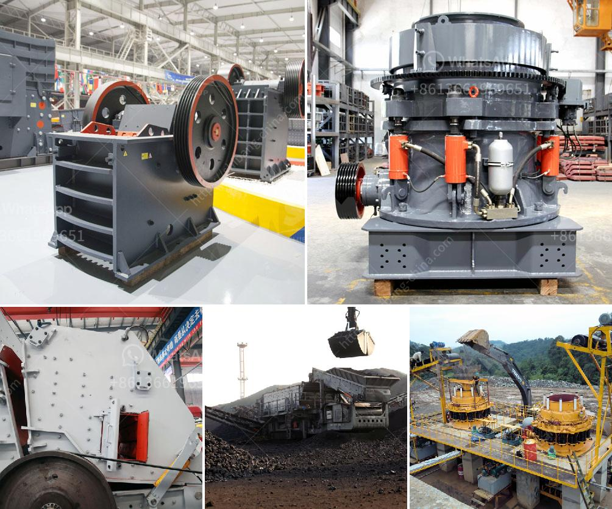

<h3>concrete crusher for rent qatar</h3>
Concrete crushers are designed to crush concrete, demolish and reduce waste materials, and recycle the concrete debris. These crushers can be used in many applications, such as crushing asphalt or concrete aggregates for road construction, recycling concrete for reuse in different projects, or to reduce the size of concrete debris after demolition or renovation activities.

In Qatar, a concrete crusher for rent can be easily found. These machines are high-performing and reliable, providing an effective and efficient way to process concrete quickly and accurately. Their compact design makes them easy to transport, maneuver, and operate.

One of the main advantages of renting a concrete crusher in Qatar is its versatility. With the ability to crush various materials, it is suitable for different applications. Whether you need to crush concrete slabs, asphalt, or rocks, a concrete crusher can handle the task with efficiency. This makes it a valuable tool for contractors and construction companies working on various projects.

Renting a concrete crusher in Qatar also offers cost savings compared to purchasing one. Purchasing a crusher requires a significant investment, not only in the equipment itself but also in its maintenance and operation. On the other hand, renting a crusher eliminates these costs. It also eliminates the need for additional storage space and reduces the risk of equipment depreciation.

Furthermore, renting a concrete crusher allows you to choose the latest and most advanced models available in the market. Manufacturers are constantly developing new technologies and features to improve the performance and efficiency of these machines. Renting ensures that you have access to the best equipment without the need for a long-term commitment or financial burden.

When considering renting a concrete crusher in Qatar, it is essential to select a reputable rental company. Look for a company with a wide range of equipment options, including different sizes, models, and attachments, to cater to your specific needs. Additionally, choose a company with a track record of excellent customer service, maintenance support, and on-time delivery.

Before renting a concrete crusher, it is also important to have a clear understanding of the specific requirements of your project. This includes the desired output size, capacity, and any special features or attachments required. Communicate these requirements with the rental company to ensure that you get the most suitable crusher for your project.

In conclusion, renting a concrete crusher in Qatar offers numerous benefits, including versatility, cost savings, and access to the latest equipment. Whether you are involved in road construction, demolition, or renovation projects, a concrete crusher can significantly improve your operations. Select a reputable rental company and communicate your project requirements to ensure a smooth and successful rental experience.
<h3>Contact us</h3><ul><li><strong>Whatsapp:&nbsp;<a href="https://wa.me/8613661969651">+8613661969651</a></strong></li><li><a href="https://swt.shibang-china.com/?git&amp;zhl&amp;concrete crusher for rent qatar"><strong>Online Service(chat now)</strong></a></li></ul><h3>Related</h3><ul><li><a href='new generation of hammer mill.md'>new generation of hammer mill</a></li><li><a href='iron ore concentrate plant tpa production.md'>iron ore concentrate plant tpa production</a></li><li><a href='300tph ball mill manufacturer in philippines.md'>300tph ball mill manufacturer in philippines</a></li><li><a href='mini robo sand unit price in india.md'>mini robo sand unit price in india</a></li><li><a href='smill grinding mill machine price.md'>smill grinding mill machine price</a></li></ul>