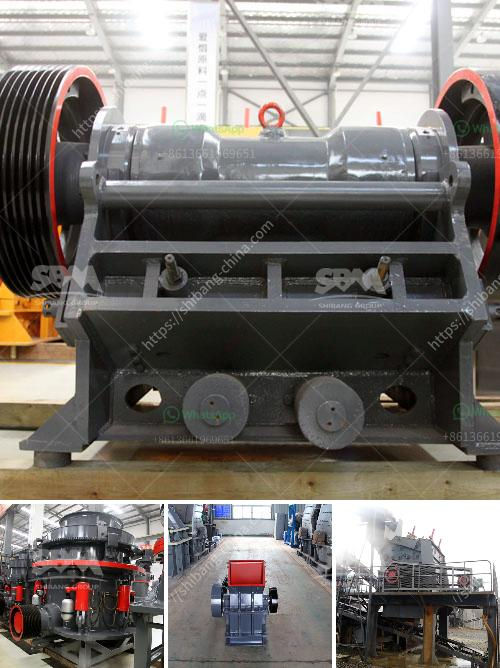

<h3>concrete crusher hire price in south africa</h3>
Concrete crusher hire in South Africa is a popular choice for many businesses looking to upgrade their machinery. With the ability to crush concrete on site, effectively reducing waste and saving money, it has become a popular choice for recycling construction and demolition waste in the country. Prices vary depending on the size of the machine, the duration of the hire, and the specific requirements of the project.

The price range for concrete crusher hire in South Africa is quite diverse, depending on the scope of work required. Prices range from around R10,000 to R100,000 or more, depending on the size and capacity of the concrete crusher, as well as the length of the hire period. Smaller, standalone crushers are ideal for smaller demolition or construction projects with a limited budget, while larger crushers with higher capacity are better suited for larger scale projects.

It is important to note that the price of hiring a concrete crusher in South Africa is often dependent on other factors as well, such as the location of the project, the availability of the machine, and any additional services required. Some suppliers may also offer discounted rates for longer-term hires or for multiple machines hired at once.

Despite the varying prices, hiring a concrete crusher is generally a cost-effective solution for recycling construction waste. By crushing and reusing concrete on site, businesses can save on disposal costs, transportation costs, and reduce the environmental impact of their construction projects. Additionally, hiring a concrete crusher allows businesses to have greater control over their projects, as they can crush concrete as it is generated, and reuse it immediately onsite.

In conclusion, concrete crusher hire prices in South Africa can vary greatly depending on the size and capacity of the machine, the duration of the hire, and other factors. However, it is generally a cost-effective solution for businesses looking to recycle construction waste and save money on disposal and transportation costs. With the ability to crush concrete on site, businesses can have greater control over their projects and reduce their environmental impact.
<h3>Contact us</h3><ul><li><strong>Whatsapp:&nbsp;<a href="https://wa.me/8613661969651">+8613661969651</a></strong></li><li><a href="https://swt.shibang-china.com/?git&amp;zhl&amp;concrete crusher hire price in south africa"><strong>Online Service(chat now)</strong></a></li></ul><h3>Related</h3><ul><li><a href='pe jaw crusher price list.md'>pe jaw crusher price list</a></li><li><a href='crusher size 1 ton capacity hour.md'>crusher size 1 ton capacity hour</a></li><li><a href='jaw crushers china.md'>jaw crushers china</a></li><li><a href='used crusher price in nigeria.md'>used crusher price in nigeria</a></li><li><a href='coal crusher machine capacity of 5 tons an hour.md'>coal crusher machine capacity of 5 tons an hour</a></li></ul>