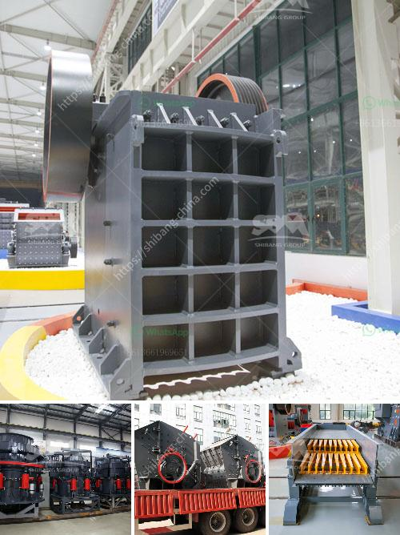

<h3>concrete crushing companies in nigeria</h3>
Concrete is one of the most used materials in the construction industry. Due to its strength and durability, it is commonly used for the construction of buildings, roads, bridges, and other infrastructure projects. However, after serving its purpose, concrete eventually needs to be demolished or removed to make way for new construction.

This is where concrete crushing companies come into play. These companies specialize in the breaking down, removal, and recycling of concrete waste. They use heavy-duty machinery and equipment to crush concrete into smaller, manageable pieces, which can then be recycled and used as a base material for new construction projects.

In Nigeria, the demand for concrete is on the rise due to the ongoing construction and infrastructure development projects in the country. With the increasing demand for concrete, it is essential to find efficient ways to handle and dispose of concrete waste. This is where concrete crushing companies come into play.

Concrete crushing companies in Nigeria are experiencing a boom in business, driven by the major road expansion projects happening across the country. However, due to the ongoing pandemic, they are also experiencing challenges in terms of manpower shortage and lack of sufficient equipment to get the job done.

Concrete crushing companies in Nigeria need a steady supply of raw materials for their production. This is where the services of real estate developers come into play. Real estate developers in Nigeria are major consumers of concrete. To get concrete, developers will need to liaise with concrete crushing companies.

Concrete crushing companies in Nigeria also require access to a large supply of aggregate materials (gabbro, gravel, granite, and quartzite) to ensure their production. To meet the demand of construction projects, concrete crushing plants should be installed in a strategic location close to the construction site. This will minimize the distance aggregate has to be transported, which in turn reduces transportation costs and carbon emissions.

One of the leading concrete crushing companies in Nigeria, DenRon Crushes, has a fleet of heavy-duty equipment and machinery dedicated to crushing, recycling, and grinding concrete into reusable aggregates. It also has a huge stockpile of aggregates in different sizes for various construction projects. DenRon Crushes is committed to providing sustainable solutions for managing concrete waste and is continuously exploring ways to improve its processes and reduce its environmental impact.

In conclusion, concrete crushing companies play a significant role in managing concrete waste in Nigeria. With the increasing demand for concrete, they offer a sustainable solution for recycling and reusing concrete waste. However, to ensure efficient operations, these companies need access to a steady supply of raw materials and proper infrastructure. It is crucial for the Nigerian government to support and encourage the growth of these companies by providing necessary resources and creating a conducive business environment.
<h3>Contact us</h3><ul><li><strong>Whatsapp:&nbsp;<a href="https://wa.me/8613661969651">+8613661969651</a></strong></li><li><a href="https://swt.shibang-china.com/?git&amp;zhl&amp;concrete crushing companies in nigeria"><strong>Online Service(chat now)</strong></a></li></ul><h3>Related</h3><ul><li><a href='how much is earned in the stone crusher.md'>how much is earned in the stone crusher</a></li><li><a href='gold recovery process flow diagram pdf.md'>gold recovery process flow diagram pdf</a></li><li><a href='pe jaw crusher price list.md'>pe jaw crusher price list</a></li><li><a href='cone crusher contractors in egypt.md'>cone crusher contractors in egypt</a></li><li><a href='river stone crusher plant.md'>river stone crusher plant</a></li></ul>