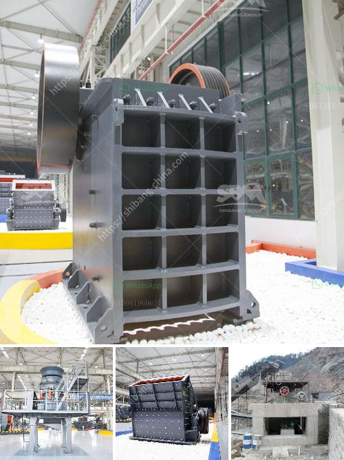

<h3>concrete crushing plant business plan</h3>
A concrete crushing plant business plan is a written document that outlines your business’s objectives and how it will be executed. It sets out your goals, finances, market analysis, and the strategies you will use to achieve them. Concrete crushing plants can be used in recycling operations and can help producers reduce costs, while generating the same amount of profit.

Before starting a concrete crushing plant, you need to analyze the budget and profit margins to ensure whether it is a viable business idea. Even if you have substantial experience in this field, a business plan is essential. Here are a few reasons why:

1. Financing: A well-written business plan is crucial when applying for loans and other financial support. Lenders will want to see your projections, financial statements, and the potential return on investment.

2. Market research: Conduct a thorough analysis of the concrete recycling industry. Identify your target market, potential customers, and competitors. Understanding the market demand will help you tailor your services accordingly.

3. Marketing strategy: A concrete crushing plant needs to effectively market its services to reach potential customers. Your business plan should include a detailed marketing strategy that outlines the promotional activities you will undertake.

4. Risks and challenges: Identify any challenges or risks that your business may face. This could include laws and regulations, environmental concerns, or competition. By identifying these risks, you can develop strategies to mitigate them.

5. Operational requirements: Outline the equipment, machinery, and workforce needed for your concrete crushing plant. Discuss whether you will lease or purchase the equipment and detail how it will be maintained.

6. Financial projections: Prepare detailed financial projections, including profit and loss statements, cash flow analysis, and balance sheets. These will help you track the financial health of your business and show potential investors or lenders the return on their investment.

In conclusion, a concrete crushing plant business plan is essential for every entrepreneur who wants to start their own concrete recycling business. It will help you secure financial support, outline your marketing strategies, and give you a clear roadmap to success. Take the time to carefully research and craft your plan to ensure a stronger foundation for your business.
<h3>Contact us</h3><ul><li><strong>Whatsapp:&nbsp;<a href="https://wa.me/8613661969651">+8613661969651</a></strong></li><li><a href="https://swt.shibang-china.com/?git&amp;zhl&amp;concrete crushing plant business plan"><strong>Online Service(chat now)</strong></a></li></ul><h3>Related</h3><ul><li><a href='hammer mill in bogota.md'>hammer mill in bogota</a></li><li><a href='ball mills in limpets.md'>ball mills in limpets</a></li><li><a href='fine grinding mill specifications.md'>fine grinding mill specifications</a></li><li><a href='ball mill in ceramic industry.md'>ball mill in ceramic industry</a></li><li><a href='crushing processing equipment.md'>crushing processing equipment</a></li></ul>