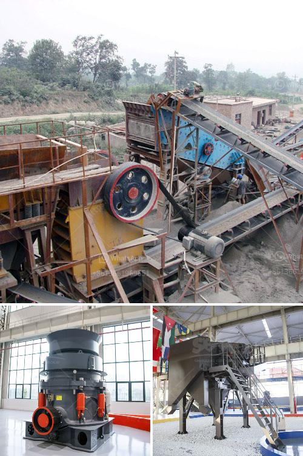

<h3>concrete jaw crusher</h3>
The concrete jaw crusher is a versatile tool that efficiently pulverizes concrete debris into usable material. This machine is easy to operate and requires minimal maintenance, making it a reliable option for any construction company.

The concrete jaw crusher works by using two jaws, one fixed and one movable, to break down large chunks of concrete into smaller pieces. The movable jaw is mounted on a rotating shaft, which ensures optimal performance and long service life. The jaws are lined with replaceable wear-resistant plates, ensuring that the machine can handle even the toughest of materials.

One of the key benefits of the concrete jaw crusher is that it allows you to easily separate different sizes of aggregate material. This means that you can reuse larger pieces of crushed concrete as fill for trenches and foundations, while the smaller, finer materials can be used as a base for new construction projects. This not only saves money but also reduces the environmental impact of demolition and construction waste.

Another advantage of the concrete jaw crusher is that it is highly efficient and produces a high-quality product. The machine's powerful motor and robust construction allow it to crush large amounts of concrete quickly and effectively. This means that you can maximize your productivity and achieve faster project completion times.

Additionally, the concrete jaw crusher is designed with safety in mind. The machine comes equipped with a hydraulic system that protects against the possibility of sudden failures or accidents. The system also allows for easy adjustment of the crusher's settings, ensuring that you can achieve the desired size and shape of the crushed material.

Furthermore, the concrete jaw crusher is easy to transport. Its compact design and lightweight construction make it suitable for use in a variety of construction sites. You can easily move the machine from one location to another, saving you time and effort.

In conclusion, the concrete jaw crusher is a valuable asset for any construction company. Its versatility, efficiency, and reliability make it an essential tool for crushing concrete debris into reusable material. By investing in this machine, you can reduce costs, save time, and contribute to a more sustainable construction industry.
<h3>Contact us</h3><ul><li><strong>Whatsapp:&nbsp;<a href="https://wa.me/8613661969651">+8613661969651</a></strong></li><li><a href="https://swt.shibang-china.com/?git&amp;zhl&amp;concrete jaw crusher"><strong>Online Service(chat now)</strong></a></li></ul><h3>Related</h3><ul><li><a href='coal wash plant indonesia.md'>coal wash plant indonesia</a></li><li><a href='cheat gold crusher.md'>cheat gold crusher</a></li><li><a href='cone crusher csd 900 price.md'>cone crusher csd 900 price</a></li><li><a href='stone crushers manufacturer.md'>stone crushers manufacturer</a></li><li><a href='wet grinder price in nigeria.md'>wet grinder price in nigeria</a></li></ul>