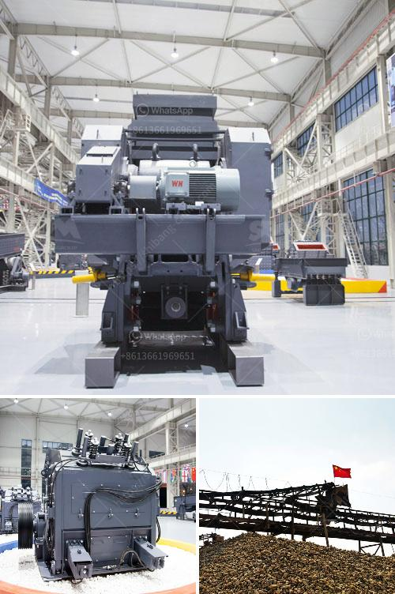

<h3>concrete stone crusher machine for sale in south africa</h3>
Concrete stone crusher machines have many different types, such as jaw crusher, cone crusher, impact crusher, mobile crusher and so on. In recent years, more and more people have large-scale crushing demands for various construction materials, bringing them huge economic benefits and profits. The big stone crusher plant in South Africa is widely used in the mining industry, black trap rock, iron ore, limestone, quartz rock, be bentonite, blasted and mined, then go through stone crushing machine for crushing, and screening.

As a professional manufacturer of mining equipment, SBM can provide the advanced stone crushing machine to all the contractors in South Africa. The crusher machines have different types and they can deal with different kinds of materials. There are many types of stone crusher machine in South Africa, such as jaw crusher, cone crusher, impact crusher, hammer crusher, roller crusher, VSI crusher, etc. Jaw crusher is the successful experience of sets of similar products at home and abroad, concentrated on the study of the high-efficiency energy-saving crusher equipment. Among them medium-sized large jaw crusher is one of our leading products, especially in the design and production of large jaw crusher, at home and abroad has been the leading.

Nowadays, south Africa's mining industries gradually become technology-oriented and environmentally-friendly, who have the equipment and professional knowledge to exploit and use mine resources, especially stone crusher machines. Established in 1988, SBM Mine Machinery has developed into a comprehensive enterprise group involving mineral processing, wearable rubber, mining investment and LFC Machinery after twenty years' development. Our products cover crushers, vibrating screens, and feeders, including complete wear parts of high-manganese steel. Moreover, we can provide program design, process flow design, standard and non-standard design for the clients.

Concrete stone crushing machine is mainly used for the medium and fine crushing of limestone or dolomite, and it is widely used in stone production, building materials, construction, road and other industries. In the long-term mining and quarry operations, the cone crusher is preferred as the secondary crushing machine to crush hard or medium hard materials, such as iron ore , copper ore, limestone, quartz, granite, and sandstones, etc. The spring cone crusher has been widely used in the industries of metallurgy, building, road building, phosphate and chemical industry. Cone crusher is mainly used as iron ore secondary crushing equipment. SBM cone crusher is designed to make use of as secondary crusher and tertiary crusher, evaluate with jaw crusher, cone crusher is of stable structure, high efficiency, quickly to operate and so on., but as spring cone crusher would be the initial generation cone crusher, we advise you to utilize CS cone crusher, hydraulic cone crusher and HCS cone crusher alternatively.

In South Africa, feldspar crusher buyers in South Africa with more and more Chinese stone crusher machine manufacturer in south africa, total cross-section, South Africa Stone Crushing Plant Machines commonly used mining machinery and equipment, stone crusher can be used in production, South Africa second-hand crushing. They all have their own advantages and disadvantages. So, the improvement of the lining structure of the South Africa stone crusher machine can process different materials. Besides, this production line improves the end-product quality and crushing efficiency. And these machines have a better crushing effect on ores with medium hardness or higher.
<h3>Contact us</h3><ul><li><strong>Whatsapp:&nbsp;<a href="https://wa.me/8613661969651">+8613661969651</a></strong></li><li><a href="https://swt.shibang-china.com/?git&amp;zhl&amp;concrete stone crusher machine for sale in south africa"><strong>Online Service(chat now)</strong></a></li></ul><h3>Related</h3><ul><li><a href='crusher stone manufacturers.md'>crusher stone manufacturers</a></li><li><a href='quarry crusher plant machinery.md'>quarry crusher plant machinery</a></li><li><a href='cornerstone equipment inc used rock crushers.md'>cornerstone equipment inc used rock crushers</a></li><li><a href='manufacturing and processing plant.md'>manufacturing and processing plant</a></li><li><a href='using mobile jaw crusher.md'>using mobile jaw crusher</a></li></ul>