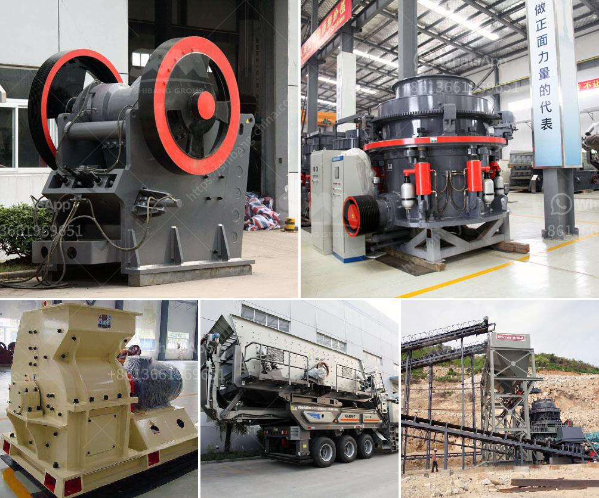

<h3>cone crusher calculation</h3>
A cone crusher calculation is a valuable tool for quarry owners who want to improve the efficiency and profitability of their operations. Cone crushers are widely used in the mining and aggregate industries to crush various types of ores and rocks with different hardness levels.

In order to optimize the performance of a cone crusher, it is essential to understand the factors that influence the capacity, power, and product size. A cone crusher calculation provides a comprehensive analysis and helps to identify the bottleneck in a process, thus allowing the operator to identify areas for improvement.

One of the most important aspects of a cone crusher calculation is the feed opening. The larger the feed opening, the higher the capacity of the crusher. However, a larger feed opening also requires a larger motor and a higher power rating, which can have cost implications. Therefore, it is crucial to find a balance between the desired capacity and the available power.

Another critical parameter in a cone crusher calculation is the closed side setting (CSS). The CSS is the smallest distance between the mantle and concave at the bottom of the crusher cavity. By adjusting the CSS, the operator can control the product size and shape. A small CSS results in a finer product, while a larger CSS produces a coarser product. The combination of the CSS and the feed opening determines the crusher's capacity and product size distribution.

The eccentric throw is another factor that affects the cone crusher's performance. The eccentric throw is the shortest distance between the mantle and concave at the top of the crusher cavity. A larger eccentric throw results in a higher capacity and finer product, while a smaller eccentric throw limits the crusher's capacity and increases the product size.

The stroke length is closely related to the eccentric throw and impacts the crusher's overall performance. The stroke length is the distance that the mantle moves during each cycle of the crusher's eccentric rotation. It determines the amount of material that can be crushed with each stroke, thus influencing the crusher's capacity.

To obtain accurate and reliable calculations, it is crucial to consider the material properties, such as density and abrasiveness, as these parameters influence the cone crusher's performance. A harder and more abrasive material requires more power and can affect the wear of the crusher's components. Therefore, it is essential to select the correct crusher liner profile and crushing chamber configuration to optimize the crushing process.

In conclusion, a cone crusher calculation is a valuable tool for quarry operators who want to improve the efficiency and profitability of their operations. By analyzing the feed opening, closed side setting, eccentric throw, stroke length, and material properties, an operator can identify areas for improvement and optimize the crusher's performance. This leads to increased productivity, reduced downtime, and higher profitability. Therefore, a cone crusher calculation should be an essential part of every quarry operator's toolkit.
<h3>Contact us</h3><ul><li><strong>Whatsapp:&nbsp;<a href="https://wa.me/8613661969651">+8613661969651</a></strong></li><li><a href="https://swt.shibang-china.com/?git&amp;zhl&amp;cone crusher calculation"><strong>Online Service(chat now)</strong></a></li></ul><h3>Related</h3><ul><li><a href='stone crusher plant for sale philippines.md'>stone crusher plant for sale philippines</a></li><li><a href='arriendo de chancadores chile.md'>arriendo de chancadores chile</a></li><li><a href='equipment needed for coal mining.md'>equipment needed for coal mining</a></li><li><a href='marble crusher for sale in portugal.md'>marble crusher for sale in portugal</a></li><li><a href='used jaw crusher machine for sale nepal.md'>used jaw crusher machine for sale nepal</a></li></ul>