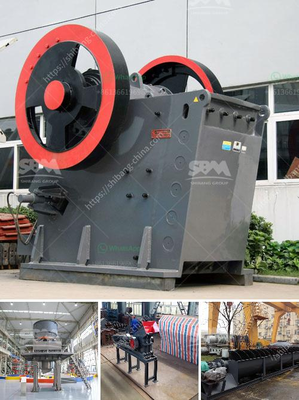

<h3>cone crusher contractors in egypt</h3>
Egypt is a country rich in mineral resources that presents immense opportunities for boosting the nation's economy. With such potentials, various industries, including mining and quarrying, seek efficient and cost-effective ways to process these resources. One crucial piece of equipment that greatly contributes to this goal is the cone crusher. Cone crusher contractors in Egypt have recognized its significance in relation to the country's growing industry.

Cone crushers are heavy-duty machines designed to crush rocks and minerals into smaller pieces, enabling efficient processing of materials. These machines operate by rotating the mantle, causing the concave surfaces to compress and crush the material. The crushed material then exits the crushing chamber through a discharge opening.

Egyptian cone crusher contractors are renowned for their expertise in handling different types of materials, including granite, limestone, and basalt, among others. Their knowledge and experience in operating and maintaining cone crushers ensure maximum efficiency in the processing plants.

Furthermore, cone crusher contractors in Egypt prioritize safety and maintain high-quality standards. They understand the risks associated with operating such heavy machinery and ensure that all safety precautions are in place. They also carry out regular maintenance and inspections to ensure the cone crushers are functioning optimally.

Additionally, these contractors offer comprehensive services to their clients. They are involved in all stages of the project, from equipment selection and installation to ongoing maintenance and repair. This allows for a seamless and efficient operation, as clients can rely on their expertise throughout the entire process.

Another advantage of engaging cone crusher contractors in Egypt is their commitment to customer satisfaction. They understand the specific needs and requirements of clients and provide tailored solutions accordingly. By offering excellent customer service, these contractors establish long-term relationships and gain the trust of their clients.

In conclusion, cone crusher contractors in Egypt play a vital role in the country's mining and quarrying industry. Their expertise, efficiency, and commitment to safety and customer satisfaction contribute significantly to the optimal processing of mineral resources. By engaging these contractors, businesses can unlock the full potential of Egypt's wealth in minerals, leading to economic growth and prosperity.
<h3>Contact us</h3><ul><li><strong>Whatsapp:&nbsp;<a href="https://wa.me/8613661969651">+8613661969651</a></strong></li><li><a href="https://swt.shibang-china.com/?git&amp;zhl&amp;cone crusher contractors in egypt"><strong>Online Service(chat now)</strong></a></li></ul><h3>Related</h3><ul><li><a href='portable cone crusher specification.md'>portable cone crusher specification</a></li><li><a href='large capacity jaw crusher machines sales to india.md'>large capacity jaw crusher machines sales to india</a></li><li><a href='jual stone crusher plant kredit.md'>jual stone crusher plant kredit</a></li><li><a href='ball mill machine price in india.md'>ball mill machine price in india</a></li><li><a href='cost quarry machines.md'>cost quarry machines</a></li></ul>