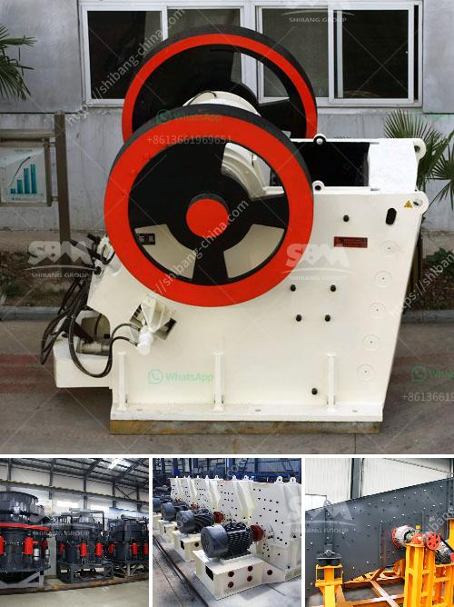

<h3>cone crusher csd 900 price</h3>
The cone crusher CSD 900 price has always been the focus of users' attention. It is not only the cone crusher with high quality and low price, but also the first choice for many buyers. However, many new customers do not know about cone crusher CSD 900 price, or their understanding is not comprehensive enough. Today, let's take a detailed understanding of cone crusher CSD 900 price.

The cone crusher CSD 900 belongs to the medium cone crusher machine. It is mainly used in the secondary crushing segment, which can efficiently process a wide variety of materials. The materials it can crush include limestone, granite, basalt, diabase, river pebbles, iron ore, etc. It has the advantages of high crushing efficiency, large processing capacity, uniform product size, and good grain shape.

Compared with other manufacturer's cone crushers, the cone crusher CSD 900 price is relatively low. This is mainly due to the following reasons. Firstly, the cone crusher CSD 900 is independently produced by the company, without the added cost of middlemen. Secondly, the company has advanced technology and strong production capacity, which can reduce production costs and offer customers a more favorable price. Lastly, the company has a large number of loyal customers, which provides the company with a stable source of orders and can effectively reduce the cost.

In addition to the above factors, the cone crusher CSD 900 price is also affected by market supply and demand. If the market demand is high, the price may be slightly higher. Conversely, if the market demand is low, the price may be more affordable. Therefore, customers should choose the right time to buy cone crushers to get the best price-performance ratio.

When purchasing cone crusher CSD 900, customers should not only pay attention to the price but also focus on its quality and after-sales service. The cone crusher CSD 900 produced by the company has passed the ISO9001:2015 international quality system certification and has been well received by customers at home and abroad. Besides, the company has a professional after-sales service team, which can provide customers with timely and effective technical support and services, ensuring worry-free use of the equipment.

To sum up, the cone crusher CSD 900 price is more cost-effective, making it the first choice for many customers. However, customers should not only pay attention to the price but also need to consider its quality and after-sales service. With its excellent performance, reasonable price, and reliable after-sales service, the cone crusher CSD 900 can bring customers efficient and worry-free crushing experiences.
<h3>Contact us</h3><ul><li><strong>Whatsapp:&nbsp;<a href="https://wa.me/8613661969651">+8613661969651</a></strong></li><li><a href="https://swt.shibang-china.com/?git&amp;zhl&amp;cone crusher csd 900 price"><strong>Online Service(chat now)</strong></a></li></ul><h3>Related</h3><ul><li><a href='concrete crushing plant business plan.md'>concrete crushing plant business plan</a></li><li><a href='crushing machine from china.md'>crushing machine from china</a></li><li><a href='malaysia industrial mill.md'>malaysia industrial mill</a></li><li><a href='graphite processing flowsheet.md'>graphite processing flowsheet</a></li><li><a href='mobile rock crushers in ghana.md'>mobile rock crushers in ghana</a></li></ul>