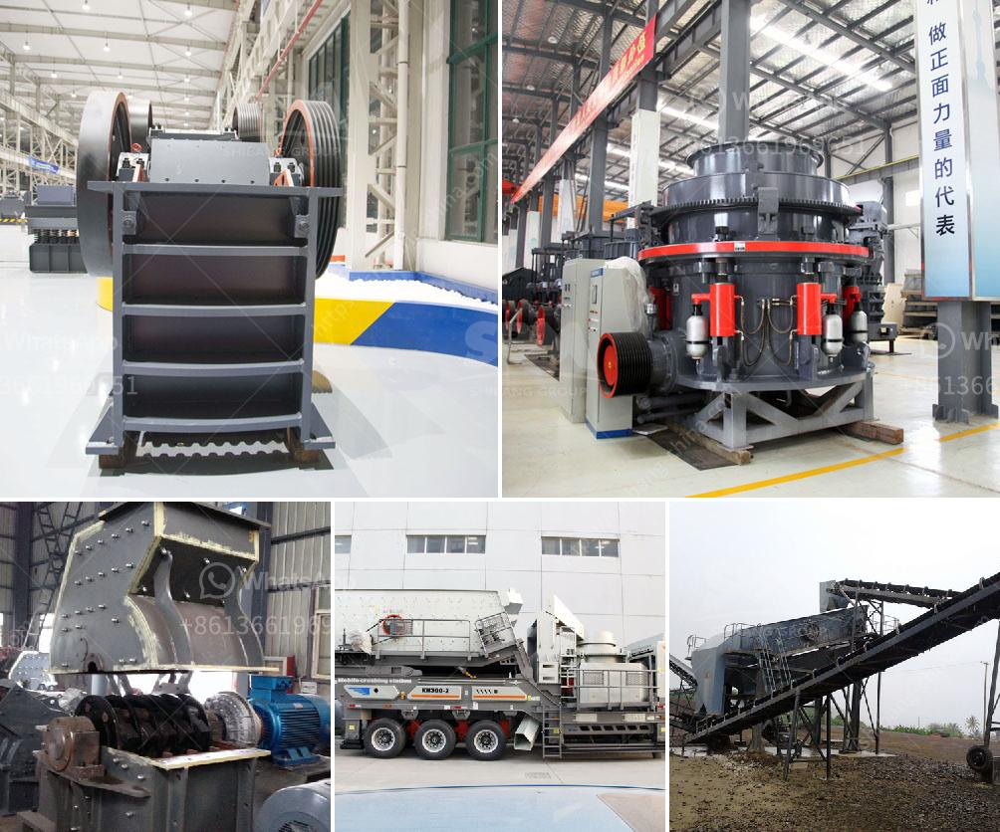

<h3>cone crusher deos in mexico</h3>
Mexico is a country rich in mineral resources and ranks among the world's top producers of several minerals. The mining industry plays a crucial role in Mexico's economy, contributing significantly to its GDP and employment. One vital equipment in this industry is the cone crusher, which helps break down and convert large rocks into smaller aggregates for further processing and usage. In this article, we will explore the importance of cone crushers in Mexico's mining industry, their components, working mechanism, and their significance in the overall production process.

Cone crushers are widely used in the mining industry due to their high efficiency, processing capacity, and versatility. They play a vital role in reducing large rocks into smaller, more manageable sizes, making them suitable for various applications, including construction, road building, and ore processing. Mexico's mining industry heavily relies on cone crushers for numerous operations, such as blasting and crushing of materials.

A cone crusher consists of various components that work together to break down rocks efficiently. The primary components of a cone crusher include:

1. Mainframe: The mainframe provides structural support to the entire crusher and houses the components responsible for controlling and regulating the crusher's operations.

2. Crushing Chamber: The crushing chamber is where the rocks enter and get crushed as they move between the mantle and concave. The shape and design of the crushing chamber significantly affect the performance and efficiency of the cone crusher.

3. Mantle and Concave: The mantle and concave are essential parts of the cone crusher that enable the crushing process. The mantle is a fixed component, while the concave is a movable component responsible for creating the crushing action.

Cone crushers utilize a rotating mantle and concave to compress and squeeze the rocks against each other, resulting in fine, uniformly compressed aggregates. The material entering the crusher passes through the crushing chamber and gets crushed under extreme pressure. The crushed material is later discharged through the bottom opening, known as the discharge port.

1. Improved Efficiency: Cone crushers help boost the overall efficiency of mining operations by reducing the size of raw materials, making them more manageable and easier to transport and process.

2. Mineral Processing: Cone crushers aid in the initial processing of minerals. They play a crucial role in breaking down materials extracted from mines before further processing, such as grinding or sorting.

3. Safety and Environmental Benefits: Cone crushers contribute to safer mining operations by reducing the risks associated with manual handling of large rocks. Additionally, smaller aggregates produced by cone crushers minimize the environmental impact during transportation and processing.

Cone crushers have become indispensable equipment in the Mexican mining industry. They play a crucial role in breaking down large rocks into smaller, workable sizes, which have widespread applications in various sectors – from construction to ore processing. The high efficiency, processing capacity, and versatility of cone crushers make them a vital component in Mexico's mining operations. As the mining industry continues to grow, the demand for cone crushers in Mexico is expected to rise further, highlighting their significance in the country's mining sector.
<h3>Contact us</h3><ul><li><strong>Whatsapp:&nbsp;<a href="https://wa.me/8613661969651">+8613661969651</a></strong></li><li><a href="https://swt.shibang-china.com/?git&amp;zhl&amp;cone crusher deos in mexico"><strong>Online Service(chat now)</strong></a></li></ul><h3>Related</h3><ul><li><a href='silica sand price per ton.md'>silica sand price per ton</a></li><li><a href='small mobile limestone crushers.md'>small mobile limestone crushers</a></li><li><a href='ethiopia conveyor belt india.md'>ethiopia conveyor belt india</a></li><li><a href='counties roller mills.md'>counties roller mills</a></li><li><a href='chrome ore refinery processing plant.md'>chrome ore refinery processing plant</a></li></ul>