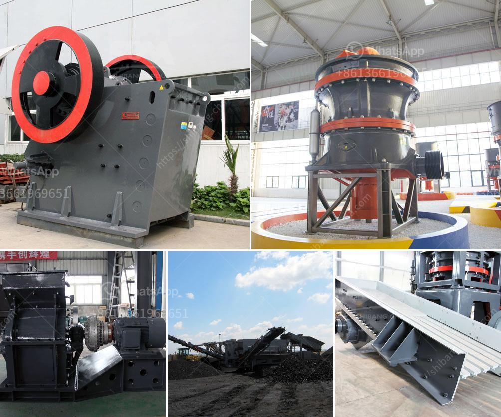

<h3>cone crusher mobile</h3>
The cone crusher is a crushing machine that utilizes compressive force to reduce materials into smaller pieces. It is widely used in construction, mining, and aggregate industry for crushing hard and medium-hard materials, such as limestone, granite, gravel, quartz, iron ore, copper ore, and many more.

What sets the cone crusher mobile apart from other crushing equipment is its portability. It can be easily transported to different locations, making it ideal for on-site crushing operations. This feature allows operators to save time and money by eliminating the need for hauling the material to a fixed crusher location.

The cone crusher mobile also offers flexibility in terms of configuration options. The machine can be equipped with different crushing chambers, depending on the specific requirements of the application. This ensures that the cone crusher can deliver the desired product size and shape, whether it is for road construction, concrete production, or railway ballast.

Another advantage of the cone crusher mobile is its efficient and reliable operation. The machine is equipped with advanced technology and features, such as hydraulic clearing, tramp release, and adjustable eccentric throw, which ensure high performance and productivity. It also has a user-friendly interface, making it easy to operate and maintain.

In addition, the cone crusher mobile is designed for low environmental impact. It is equipped with a dust suppression system and noise reduction features, which contribute to a cleaner and quieter working environment. This makes it a suitable choice for urban areas and sensitive locations.

Overall, the cone crusher mobile is a versatile and efficient crushing machine that offers numerous benefits to the construction and mining industry. Its portability, flexibility, and reliable operation make it a valuable asset for any project. Whether it is used for primary, secondary, or tertiary crushing, this machine is capable of producing high-quality and consistent results.
<h3>Contact us</h3><ul><li><strong>Whatsapp:&nbsp;<a href="https://wa.me/8613661969651">+8613661969651</a></strong></li><li><a href="https://swt.shibang-china.com/?git&amp;zhl&amp;cone crusher mobile"><strong>Online Service(chat now)</strong></a></li></ul><h3>Related</h3><ul><li><a href='machinery needed for limestone extraction.md'>machinery needed for limestone extraction</a></li><li><a href='sri lankan building sand price.md'>sri lankan building sand price</a></li><li><a href='dolomite refractory bricks process.md'>dolomite refractory bricks process</a></li><li><a href='crushing plant manufacturers in china.md'>crushing plant manufacturers in china</a></li><li><a href='description of a 5x6 jaw crusher.md'>description of a 5x6 jaw crusher</a></li></ul>