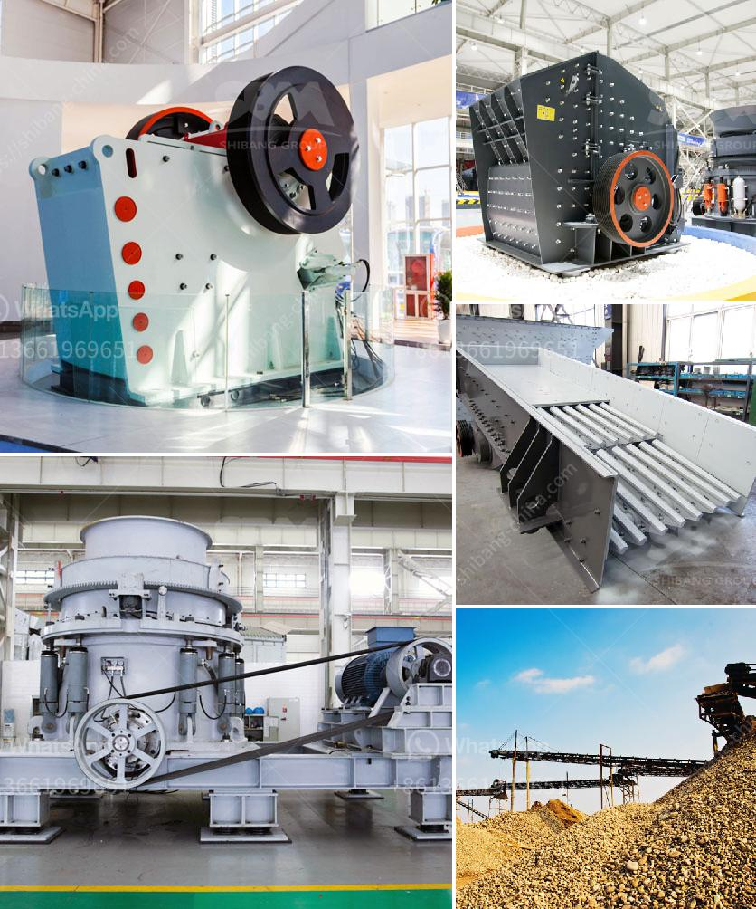

<h3>cone crusher msp300</h3>
The cone crusher MSP300 is a dependable and efficient rock crushing machine that has been utilized by numerous industries worldwide. With a capacity ranging from 105 to 585 metric tons per hour, this crusher is capable of crushing a wide range of materials, including hard and abrasive stones, gravel, limestone, and more.

One of the key features of the MSP300 is its advanced technology, which guarantees exceptional performance and high-quality end products. The hydraulic system ensures smooth and safe operation, while the adjustable eccentric throw allows for precise control over the size of the crushed materials. This makes the MSP300 ideal for producing aggregate products for construction projects or fine-tuning finely crushed materials for specific applications.

With its robust design and durable components, the MSP300 is built to withstand heavy-duty use in demanding environments. The crusher's high-quality steel frame and optimized casting components minimize downtime and increase the overall lifespan, reducing maintenance costs and maximizing production efficiency.

Additionally, the cone crusher MSP300 is versatile and adaptable to different crushing applications. Its wide range of crushing chamber options allows for customization to suit specific requirements, ensuring optimal performance and efficiency, whether in a secondary or tertiary crushing role.

Moreover, the MSP300 is user-friendly, with easy access to critical maintenance points and a straightforward control panel. This simplifies routine maintenance tasks and ensures that operators can quickly adjust settings for optimal performance, ultimately increasing uptime and productivity.

In conclusion, the cone crusher MSP300 is a reliable and efficient rock crushing machine designed to deliver high-quality end products consistently. Its advanced technology, robust design, and user-friendly features make it a valuable asset for various industries requiring efficient and precise crushing operations. Whether for aggregate production or specific material refinement, the MSP300 is a highly capable and dependable cone crusher choice.
<h3>Contact us</h3><ul><li><strong>Whatsapp:&nbsp;<a href="https://wa.me/8613661969651">+8613661969651</a></strong></li><li><a href="https://swt.shibang-china.com/?git&amp;zhl&amp;cone crusher msp300"><strong>Online Service(chat now)</strong></a></li></ul><h3>Related</h3><ul><li><a href='jaw crushers zimbabwe.md'>jaw crushers zimbabwe</a></li><li><a href='want mobile crusher on rent pune india.md'>want mobile crusher on rent pune india</a></li><li><a href='jaw crusher supplier in the philippines.md'>jaw crusher supplier in the philippines</a></li><li><a href='robinson henry roller mills.md'>robinson henry roller mills</a></li><li><a href='mobile cone crushing station for sale.md'>mobile cone crushing station for sale</a></li></ul>