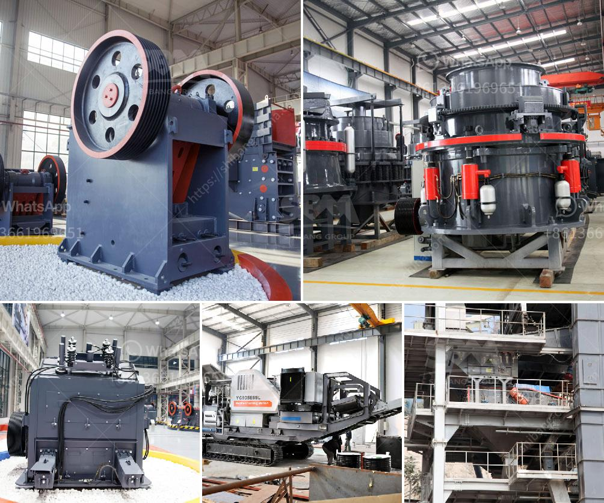

<h3>cone crushers manufacturers</h3>
Cone crushers are an important piece of machinery that are used for crushing rocks and ore. They are often used in mining, metallurgy, and construction projects. Cone crushers come in different sizes, depending on the desired output and production capacity. This article discusses cone crushers manufacturers and their wide range of products.

Cone crushers are highly effective at breaking down difficult-to-crush materials such as granite, basalt, and iron ore. It is important to find a reliable manufacturer who can supply high-quality cone crushers that offer a long lifespan and durability. Here are some notable manufacturers in the market:

Metso Outotec is a well-known cone crusher manufacturer and offers a wide range of stationary and portable cone crushers. Their models are popular for their reliability and high performance. Metso Outotec's cone crushers are suitable for a variety of different applications, including mining, quarrying, and recycling. They offer various cone crusher models, including HP (High Performance), MP (Multi-Performance), and GP (General Purpose) series.

Sandvik is another leading manufacturer of cone crushers. They offer a range of cone crushers that are known for their high productivity, reliability, and ease of maintenance. Sandvik's cone crushers are suitable for various applications, including aggregates production, mining operations, and recycling. They offer versatile cone crusher models, such as CS (Constant Speed), CH (Hydrocone), and CJ (Jaw Crusher).

Terex Finlay is a reputable manufacturer of cone crushers and other heavy-duty crushing equipment. Their cone crushers are known for their high performance and efficiency. Terex Finlay offers a range of cone crushers, including mobile cone crushers, to suit various industry needs. Their cone crusher models are popular for their flexibility, allowing operators to choose between different crushing chambers and configurations.

Thyssenkrupp is a renowned manufacturer of cone crushers that are widely used in the mining and construction industries. Thyssenkrupp cone crushers are known for their robust design, excellent performance, and long lifespan. They offer a range of cone crusher models suitable for different applications and production requirements. Thyssenkrupp's cone crushers are often used in demanding environments, such as in quarries and high-capacity mining operations.

McCloskey International is a well-established manufacturer of cone crushers and other crushing equipment. Their cone crushers are known for their versatility and high productivity. McCloskey International offers a range of cone crushers suitable for different applications, including quarrying, mining, and construction. Their cone crusher models are known for their reliability, ease of maintenance, and cost-effectiveness.

In conclusion, cone crushers are vital equipment in the mining, construction, and aggregate industries. It is crucial to choose cone crushers from reliable manufacturers that offer high-quality products and excellent customer support. The mentioned manufacturers, including Metso Outotec, Sandvik, Terex Finlay, Thyssenkrupp, and McCloskey International, are reputable and offer a wide range of cone crusher models suitable for various applications and production capacities. It is recommended to research and compare different manufacturers to find the cone crushers that best suit your specific needs.
<h3>Contact us</h3><ul><li><strong>Whatsapp:&nbsp;<a href="https://wa.me/8613661969651">+8613661969651</a></strong></li><li><a href="https://swt.shibang-china.com/?git&amp;zhl&amp;cone crushers manufacturers"><strong>Online Service(chat now)</strong></a></li></ul><h3>Related</h3><ul><li><a href='calculate grinding ball diameter for ball mill.md'>calculate grinding ball diameter for ball mill</a></li><li><a href='turkey gold processing plants.md'>turkey gold processing plants</a></li><li><a href='stone quarries south africa.md'>stone quarries south africa</a></li><li><a href='how to control partials size in vertical hammer mill.md'>how to control partials size in vertical hammer mill</a></li><li><a href='pulveriser quartzite china make.md'>pulveriser quartzite china make</a></li></ul>