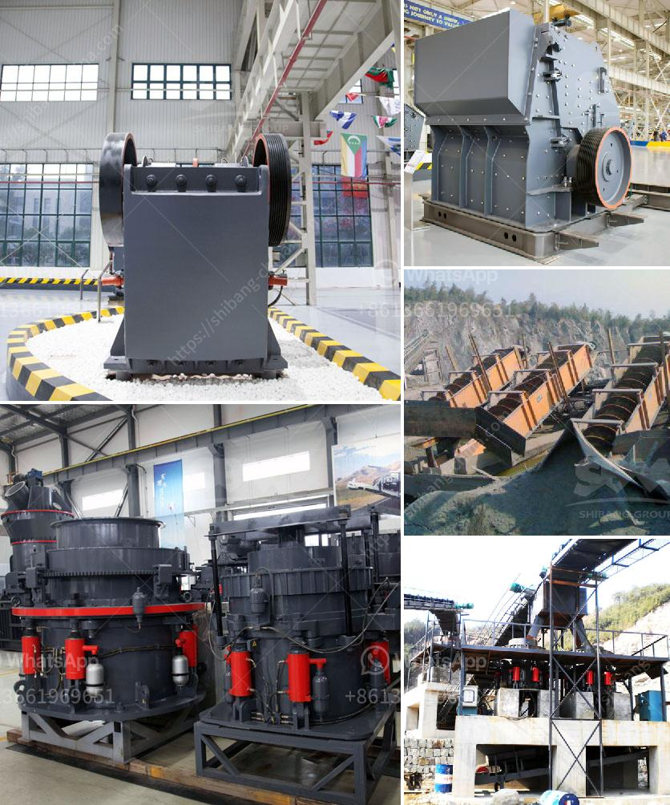

<h3>cone crushers washing system</h3>
Cone crushers are widely used in the mining and aggregate industries for crushing materials such as gravel, limestone, and granite. These machines have a crushing chamber lined with a concave, or bowl liner, as well as a mantle, both of which wear out over time and need to be replaced. However, during the crushing process, the wear liners can become clogged with fine materials, affecting the efficiency of the crusher and the quality of the final product. This is where cone crushers washing systems come into play.

A cone crusher washing system is designed to remove excess fines, liberating the closed size fraction within the crushing chamber. It allows for increased production rates while mitigating the risk of material build-up and reducing downtime for maintenance. By incorporating a washing system, cone crushers can yield higher operational efficiency and deliver a superior product to customers.

One of the primary components of a cone crusher washing system is a water tank that continuously sprays water onto the crushing chamber. This helps to flush out fines and prevent clogging of the liners. Additionally, some cone crushers are equipped with a scrubber system that uses water and mechanical action to clean the material trapped between the concave and the mantle.

Using water in cone crushers washing systems can offer several benefits. Firstly, it reduces the generation of airborne dust, enhancing the working environment for operators. Secondly, the water lubricates the wear liners, reducing friction and extending their lifespan. Moreover, a well-designed cone crusher washing system can also conserve water by recycling and reusing it within the system.

To optimize the performance of cone crushers washing systems, regular maintenance and inspection are crucial. Operators should ensure that the water spray nozzles are clean and functioning properly. They should also monitor the water level in the tank and promptly address any leaks or water-related issues.

In conclusion, cone crushers washing systems are essential for enhancing efficiency in aggregate processing. By incorporating a washing system, cone crushers can effectively remove excess fines, prevent clogging of the crushing chamber, and improve the quality of the final product. These systems also offer advantages such as reduced dust generation, extended wear liner lifespan, and water conservation. As with any equipment, proper maintenance and inspection are essential to ensure optimal performance.
<h3>Contact us</h3><ul><li><strong>Whatsapp:&nbsp;<a href="https://wa.me/8613661969651">+8613661969651</a></strong></li><li><a href="https://swt.shibang-china.com/?git&amp;zhl&amp;cone crushers washing system"><strong>Online Service(chat now)</strong></a></li></ul><h3>Related</h3><ul><li><a href='granite crusher plant.md'>granite crusher plant</a></li><li><a href='sand stone crusher.md'>sand stone crusher</a></li><li><a href='process flow of bajri washing plant.md'>process flow of bajri washing plant</a></li><li><a href='stone crusher machine malaysia.md'>stone crusher machine malaysia</a></li><li><a href='limestone treatment plant.md'>limestone treatment plant</a></li></ul>