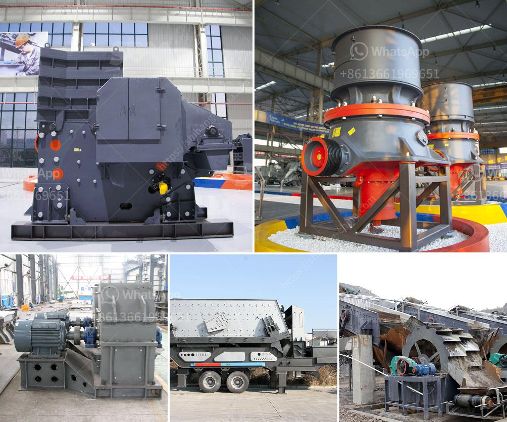

<h3>conical ball mill for sale</h3>
A ball mill, a type of grinder, is a cylindrical device used in grinding (or mixing) materials like ores, chemicals, ceramic raw materials, and paints. Ball mills rotate around a horizontal axis, partially filled with the material to be ground plus the grinding medium. Different materials are used as media, including ceramic balls, flint pebbles, and stainless steel balls. An internal cascading effect reduces the material to a fine powder.

One popular type of ball mill is a conical mill, also called a conical ball mill. This mill has a cylinder-shaped drum with a conical inner surface. The conical surface is inclined at an angle to the horizontal, meaning that the outer wall of the drum is narrower than the inner. This design increases the efficiency and effectiveness of the grinding process.

Conical ball mills are generally used for finer grinding of materials. They produce a much more controlled grind size, compared to standard ball mills. The inner walls of the conical drum are lined with materials designed to lift the material and promote grinding. This enhances the crushing action and reduces the likelihood of material becoming trapped or clumped inside the mill.

There are several advantages to using a conical ball mill. Firstly, the conical shape provides a larger effective grinding surface area, improving the overall efficiency of the mill. This means that more material can be ground within a shorter period of time, reducing processing time and costs.

Secondly, the conical shape promotes better distribution of the grinding media. The media, whether it be ceramic balls, pebbles, or steel balls, are evenly distributed along the length of the conical drum, ensuring that every particle of material is subjected to grinding action. This results in a more uniform grind size and a higher quality end product.

Furthermore, conical ball mills are versatile and can be used for wet or dry grinding. They are commonly used in the mining industry for grinding raw ore, while they are also popular in the pharmaceutical and chemical industries for grinding materials such as chemicals, minerals, and pigments.

If you are in the market for a conical ball mill, there are several options available. Many equipment manufacturers offer conical mills for sale, designed to meet various grinding needs. When selecting a conical mill, consider factors such as the desired grind size, the material to be ground, and the required capacity. It is also important to choose a reputable manufacturer known for producing high-quality, reliable equipment.

In conclusion, a conical ball mill is an efficient and cost-effective alternative to traditional horizontal mills for grinding various materials. If you are in the market for a ball mill, consider a conical ball mill. Let the experts at the equipment manufacturer assist you in finding the best solution. With a conical ball mill, you can achieve the grind you desire while improving efficiency and productivity in your operation.
<h3>Contact us</h3><ul><li><strong>Whatsapp:&nbsp;<a href="https://wa.me/8613661969651">+8613661969651</a></strong></li><li><a href="https://swt.shibang-china.com/?git&amp;zhl&amp;conical ball mill for sale"><strong>Online Service(chat now)</strong></a></li></ul><h3>Related</h3><ul><li><a href='used stone crusher for sale germany.md'>used stone crusher for sale germany</a></li><li><a href='grinding cost calculation for bm 8 usha mill.md'>grinding cost calculation for bm 8 usha mill</a></li><li><a href='50tph stone crusher in germany for sale.md'>50tph stone crusher in germany for sale</a></li><li><a href='cost of crusher plant.md'>cost of crusher plant</a></li><li><a href='cone crusher calculation.md'>cone crusher calculation</a></li></ul>