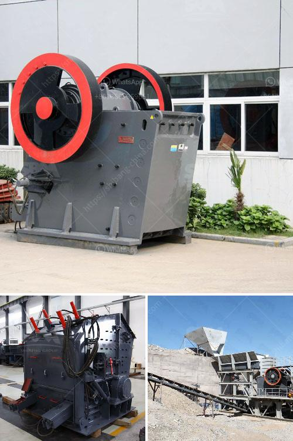

<h3>construction construction belt</h3>
In the construction industry, efficiency and safety are paramount. Every construction worker needs to have the right set of tools and equipment to ensure a smooth and successful project. One key tool that often goes unnoticed but is essential for any construction worker is the construction belt.

A construction belt is a specially designed belt that allows workers to carry various tools and equipment with ease. It typically features multiple pockets and compartments of different sizes, providing ample space for tools like hammers, screwdrivers, wrenches, tape measures, and other small handheld tools. This allows workers to have easy access to their most frequently used tools, saving valuable time and effort.

The construction belt is made from durable materials such as leather or heavy-duty nylon, ensuring its longevity even in the harshest of construction environments. These belts are often adjustable, allowing workers to find the perfect fit for their waist, ensuring comfort throughout the day. Some models even come with padding to further enhance comfort and reduce strain on the lower back.

Beyond convenience, the construction belt also contributes to improved safety on construction sites. With tools securely stored in the pockets of the belt, workers can avoid the risk of leaving them lying around, reducing the chances of accidents or injuries. The belt also frees up the worker's hands, allowing them to focus on their tasks instead of constantly searching for a tool.

The construction belt is not limited to construction workers alone; it can also be an excellent tool for DIY enthusiasts and homeowners. Whether you are doing minor repairs or undertaking a major renovation project, having a construction belt within reach keeps everything organized and within arm's reach, ensuring a smoother workflow.

In conclusion, the construction belt is an indispensable tool in the construction industry. Its convenience, durability, and safety features make it a must-have for every construction worker. Investing in a good-quality construction belt not only enhances productivity but also contributes to a safer working environment. So, if you haven't already, it's time to get yourself a construction belt and experience the difference it makes in your daily tasks.
<h3>Contact us</h3><ul><li><strong>Whatsapp:&nbsp;<a href="https://wa.me/8613661969651">+8613661969651</a></strong></li><li><a href="https://swt.shibang-china.com/?git&amp;zhl&amp;construction construction belt"><strong>Online Service(chat now)</strong></a></li></ul><h3>Related</h3><ul><li><a href='copper ore processing plants in pakistan.md'>copper ore processing plants in pakistan</a></li><li><a href='stone crusher plant operator job.md'>stone crusher plant operator job</a></li><li><a href='quarry equipment and crushers companies in japan.md'>quarry equipment and crushers companies in japan</a></li><li><a href='crushing plant for sale in.md'>crushing plant for sale in</a></li><li><a href='rock screening plants usa.md'>rock screening plants usa</a></li></ul>