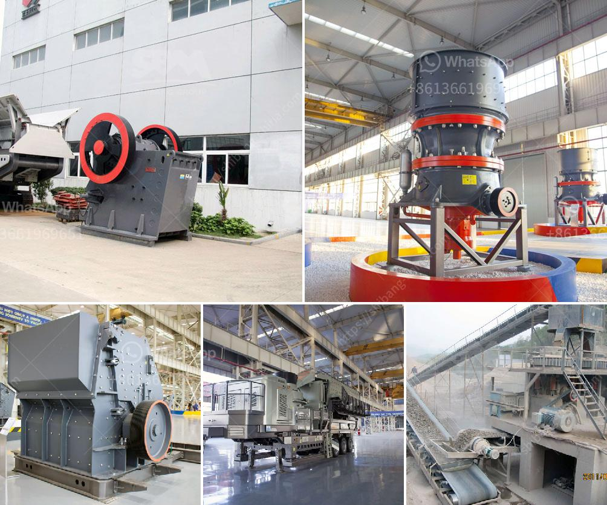

<h3>consultants to help to start a stone crusher</h3>
Starting a stone crusher plant can be intimidating for most entrepreneurs. However, this is not a hindrance for inexperienced individuals who are passionate about the industry. In fact, with the right guidance and knowledge, setting up a stone crusher plant can be a smooth and fruitful experience.

One of the critical steps to starting a stone crusher plant is conducting thorough market research. This will enable you to understand the demand for various types of crushed stones in your target market and help determine the plant's profitability. To conduct market research effectively, it is advisable to seek the assistance of experienced consultants.

Consultants specializing in the stone crusher industry can help you navigate through the operational hurdles and set up a highly productive and profitable stone crushing plant. They have a wealth of market research data that can help you understand the current dynamics and trends in the industry. This information will enable you to make informed decisions regarding important aspects such as the location of your plant, the type of stone you will produce, and the target market you will cater to.

Additionally, consultants can guide you through the legal and regulatory requirements associated with starting a stone crusher plant. These professionals will ensure that you adhere to all necessary permits, licenses, and environmental regulations, minimizing the risk of legal complications in the future.

Another crucial aspect of setting up a stone crusher plant is determining the necessary equipment and machinery required for the operation. Consultants can provide valuable insights into the different types of machinery available and advise you on the most suitable options for your specific needs. They can also help you source high-quality equipment from reliable suppliers, ensuring that you invest in durable and efficient machinery.

Furthermore, consultants can assist you in developing a comprehensive business plan for your stone crusher plant. A well-crafted business plan not only outlines your vision for the business but also helps secure funding from potential investors or financial institutions. The expertise of consultants in the industry will enable them to provide guidance on creating a compelling business plan that addresses crucial aspects such as marketing strategies, financial projections, and risk management.

In conclusion, starting a stone crusher plant requires careful planning and preparation. Engaging the services of experienced consultants can significantly ease the process and set you up for success. From market research to legal compliance and equipment selection, consultants specialize in providing the necessary expertise to ensure a smooth and profitable venture. By partnering with knowledgeable consultants, you can confidently embark on your entrepreneurial journey in the stone crushing industry.
<h3>Contact us</h3><ul><li><strong>Whatsapp:&nbsp;<a href="https://wa.me/8613661969651">+8613661969651</a></strong></li><li><a href="https://swt.shibang-china.com/?git&amp;zhl&amp;consultants to help to start a stone crusher"><strong>Online Service(chat now)</strong></a></li></ul><h3>Related</h3><ul><li><a href='hammer mill in bogota.md'>hammer mill in bogota</a></li><li><a href='crusher primary cone crusher.md'>crusher primary cone crusher</a></li><li><a href='puzolana 250 tph crusher.md'>puzolana 250 tph crusher</a></li><li><a href='harga jaw crusher.md'>harga jaw crusher</a></li><li><a href='making gypsum powder mill.md'>making gypsum powder mill</a></li></ul>