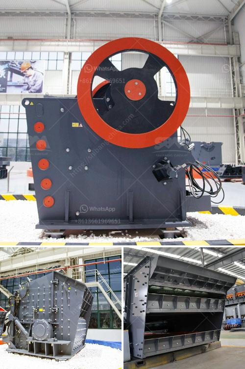

<h3>consumption ratio for ball mill</h3>
The consumption ratio for a ball mill refers to the energy saving and consumption reduction levels of the grinding process. It is an essential indicator for evaluating the efficiency of a ball mill in performing grinding work. In this article, we will explore the factors that affect the consumption ratio for a ball mill.

First and foremost, the rotational speed of the ball mill has a significant impact on the consumption ratio. As the speed increases, the centrifugal force generated by the rotating cylinder will be stronger, impacting the grinding media and producing more efficient grinding. Therefore, a higher rotational speed tends to lead to a lower consumption ratio.

Secondly, the grinding media used in the ball mill also affects the consumption ratio. The type and size of the grinding media determine the grinding efficiency and energy consumption. Generally, larger-sized grinding media have more contact points with the material, resulting in a higher grinding efficiency and lower energy consumption. Therefore, using proper grinding media with optimal size and material can effectively reduce the consumption ratio.

Furthermore, the filling rate of the grinding media in the ball mill also plays a critical role in the consumption ratio. The appropriate filling rate ensures that the grinding media are in full contact with the material, allowing for efficient grinding. Inadequate filling can lead to a decrease in grinding efficiency, while excessive filling may cause the grinding media to form a cataract state, reducing the grinding efficiency and increasing the consumption ratio. Thus, finding the optimal filling rate is crucial for achieving a low consumption ratio.

Moreover, the particle size distribution of the material being ground affects the consumption ratio. Materials with a wide particle size distribution require more energy to achieve the desired fineness. Conversely, materials with a narrower particle size distribution can be ground more efficiently, resulting in a lower consumption ratio. Therefore, optimizing the particle size distribution of the material can help reduce energy consumption.

In addition to these factors, the design of the ball mill and the selection of grinding aids can also affect the consumption ratio. A well-designed ball mill with proper liners and internal partitions can enhance the grinding efficiency and reduce energy consumption. Likewise, the use of suitable grinding aids can improve the grinding process and lead to a lower consumption ratio.

In conclusion, the consumption ratio for a ball mill is influenced by various factors, including the rotational speed, grinding media, filling rate, particle size distribution, and equipment design. By optimizing these factors, it is possible to achieve a lower consumption ratio, indicating a more efficient and energy-saving grinding process. Manufacturers and operators should pay attention to these factors to enhance the performance of their ball mills and improve overall productivity.
<h3>Contact us</h3><ul><li><strong>Whatsapp:&nbsp;<a href="https://wa.me/8613661969651">+8613661969651</a></strong></li><li><a href="https://swt.shibang-china.com/?git&amp;zhl&amp;consumption ratio for ball mill"><strong>Online Service(chat now)</strong></a></li></ul><h3>Related</h3><ul><li><a href='rock crusher for excavator.md'>rock crusher for excavator</a></li><li><a href='gold crusher cost.md'>gold crusher cost</a></li><li><a href='hammer mill production location in nigeria.md'>hammer mill production location in nigeria</a></li><li><a href='small impact gold mill australia.md'>small impact gold mill australia</a></li><li><a href='price list jaw crusher 150 x 200mm.md'>price list jaw crusher 150 x 200mm</a></li></ul>