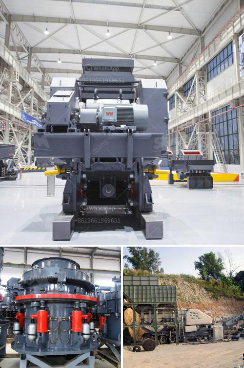

<h3>conversion rules of stone crusher</h3>
Stone crusher is essential equipment in mining machinery, common stone crusher mainly include jaw crusher, mobile crushing station, counter-attack crusher, impact crusher, compound crusher, hammer crusher, vertical crusher, etc. These stone crusher has different crushing characteristics, so their price is also different. . Therefore, customers must pay attention to the choice of stone crusher machines when configuring the crushing production line.

For the hard material crushing process, cone crusher or impact crusher are recommended. For soft materials, jaw crusher, impact crusher and hammer crusher are suitable.

The stone crusher machines with different types, structures, capacities and brands have their own strengths and weaknesses. In general, the prices of stone crusher machines are lower or more expensive. In order to save cost, customers must choose the appropriate production equipment according to the actual production situation to ensure the maximum economic benefits.

When purchasing stone crusher machines, the customers should ensure that the equipment has a strong capacity to handle various materials and produce uniform particle size. The discharge size of the equipment should meet the requirements of the customer's desired production output. In addition, the performance of the equipment should also meet the requirements of environmental protection and energy saving.

Furthermore, customers should also pay attention to the after-sales service provided by the manufacturer. A comprehensive after-sales service system can effectively guarantee the smooth operation of the equipment, reduce downtime, and extend the service life of the equipment.

In conclusion, when purchasing stone crusher machines, the customers should consider the various factors mentioned above and choose the right equipment that meets their production needs. By following the conversion rules of stone crusher, customers can ensure a successful and efficient crushing process, ultimately achieving high production and economic benefits.
<h3>Contact us</h3><ul><li><strong>Whatsapp:&nbsp;<a href="https://wa.me/8613661969651">+8613661969651</a></strong></li><li><a href="https://swt.shibang-china.com/?git&amp;zhl&amp;conversion rules of stone crusher"><strong>Online Service(chat now)</strong></a></li></ul><h3>Related</h3><ul><li><a href='cost of crusher plant.md'>cost of crusher plant</a></li><li><a href='malaysia mineral ball mill.md'>malaysia mineral ball mill</a></li><li><a href='second hand raymond mill in india.md'>second hand raymond mill in india</a></li><li><a href='crusher equipment oman in muscat oman.md'>crusher equipment oman in muscat oman</a></li><li><a href='price hammer mill price mill pulverizer.md'>price hammer mill price mill pulverizer</a></li></ul>