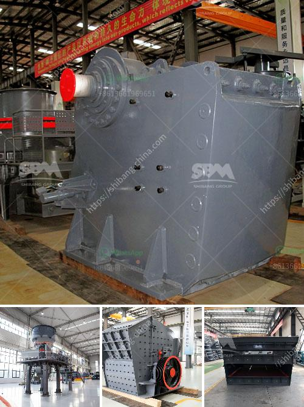

<h3>conveyor belt machine</h3>
In the fast-paced world of manufacturing, efficiency and productivity are paramount. Any innovation that can streamline production processes, increase output, and reduce labor costs is highly sought after. This is where the invention of the conveyor belt machine comes in. With its ability to automate material handling tasks, it has revolutionized the manufacturing industry.

A conveyor belt machine is a system that moves materials from one point to another along a predetermined path. It consists of a belt loop, which can be made of various materials such as rubber or metal, and a set of pulleys or rollers that facilitate movement. The conveyor belt is powered by an electric motor, which propels it forward or backward, carrying the materials along with it.

One of the key advantages of a conveyor belt machine is its ability to move large quantities of goods quickly and efficiently. Unlike manual labor, which is subject to human limitations, these machines can operate continuously without fatigue, greatly increasing productivity. By automating material handling processes, manufacturers can drastically reduce the time and effort required to transport goods between different stages of production. This leads to faster turnaround times, allowing companies to meet deadlines and fulfill customer orders in a timely manner.

Additionally, conveyor belt machines greatly minimize the risk of accidents and injuries. Manual material handling can be physically demanding and prone to accidents such as strains, sprains, or even more serious injuries. By eliminating the need for manual lifting and carrying, conveyor belt machines create a safer working environment for employees. This not only improves worker safety but also reduces healthcare costs and potential legal liabilities for companies.

Another notable benefit of conveyor belt machines is their versatility. They can be customized to meet the specific needs of different industries. For example, in the food industry, conveyor belts are designed to meet strict hygienic standards and can handle delicate products without damage. In the automotive industry, they are used to transport heavy components and streamline assembly processes. Regardless of the industry, conveyor belt machines can be modified to accommodate different weights, sizes, and shapes of materials, making them highly adaptable to various production requirements.

Furthermore, the use of conveyor belt machines promotes better inventory control. By automating material handling, manufacturers gain better visibility and control over their inventory levels. Real-time monitoring systems can be integrated into the machines, allowing companies to track the flow of materials from one point to another. This ensures that raw materials, work-in-progress, and finished goods are efficiently managed, minimizing waste and improving supply chain management.

In conclusion, the conveyor belt machine has revolutionized the manufacturing industry by improving productivity, increasing efficiency, ensuring worker safety, and promoting better inventory control. Its ability to automate material handling tasks significantly reduces manual labor, resulting in faster production cycles and reduced costs. As technology continues to advance, these machines will undoubtedly become even more sophisticated and indispensable in the modern manufacturing landscape.
<h3>Contact us</h3><ul><li><strong>Whatsapp:&nbsp;<a href="https://wa.me/8613661969651">+8613661969651</a></strong></li><li><a href="https://swt.shibang-china.com/?git&amp;zhl&amp;conveyor belt machine"><strong>Online Service(chat now)</strong></a></li></ul><h3>Related</h3><ul><li><a href='wet ball milling process.md'>wet ball milling process</a></li><li><a href='chrome crushing plant.md'>chrome crushing plant</a></li><li><a href='silica sand price per ton.md'>silica sand price per ton</a></li><li><a href='portable concrete crusher for rent qatar.md'>portable concrete crusher for rent qatar</a></li><li><a href='list of limestone mining companies in china.md'>list of limestone mining companies in china</a></li></ul>