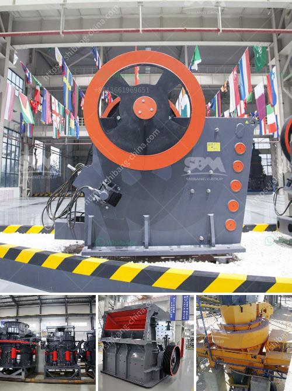

<h3>conveyor belting south africa</h3>
Conveyor belting in South Africa plays a vital role in the industrial sector, facilitating the efficient movement of goods and materials from one point to another. This versatile and reliable system has become an essential component in various industries, including mining, manufacturing, agriculture, and transportation.

The demand for conveyor belting in South Africa has steadily increased over the years, driven by the growing need for cost-effective and efficient material handling solutions. Conveyor belts are widely used for transporting bulk materials, such as ores, coal, grains, and construction materials, across different processing stages.

One of the key reasons behind the success of conveyor belting in South Africa is the diversity and richness of the country's natural resources. South Africa is abundant in mineral resources, like gold, diamonds, platinum, and coal, which require efficient conveyor systems for their extraction, processing, and transportation.

The mining industry in South Africa heavily relies on conveyor belting for its operation. Conveyor belts are used to transport extracted ores and minerals from the mining sites to the processing plants. They are critical in ensuring continuous operations and maximizing productivity in the harsh and demanding mining environment.

Furthermore, conveyor belting also plays a crucial role in the manufacturing industry. Various manufacturing processes, including assembly lines and packaging, heavily rely on conveyor systems to automate the movement of goods and components. By using conveyor belts, manufacturers can streamline their production processes, reduce labor costs, and enhance overall efficiency.

In addition to mining and manufacturing, the agricultural sector in South Africa heavily relies on conveyor belting. Conveyor systems are used for handling and transporting agricultural products, such as grains, fruits, and vegetables, from one processing stage to another. This enables farmers and food processors to maintain a smooth and efficient operation, reducing waste and ensuring the timely delivery of goods to the market.

South Africa boasts a well-established conveyor belting industry, with numerous local manufacturers and suppliers offering a wide range of products and services. These companies possess extensive expertise and knowledge in designing, manufacturing, and maintaining conveyor systems, tailored to the specific needs and requirements of different industries.

Moreover, conveyor belting companies in South Africa are also known for their commitment to quality and innovation. They continuously invest in research and development, adopting advanced technologies and materials to enhance the performance, durability, and safety of their conveyor belts. This ensures that they can meet the constantly evolving needs of the industrial sector.

In conclusion, conveyor belting in South Africa is a vital component in various industries, helping to streamline material handling processes, improve efficiency, and maximize productivity. The country's rich natural resources, coupled with the expertise and innovation of local manufacturers, have contributed to the success and continuous growth of the conveyor belting industry in South Africa. As industries continue to evolve and strive for excellence, conveyor belting will remain a crucial element in South Africa's industrial landscape.
<h3>Contact us</h3><ul><li><strong>Whatsapp:&nbsp;<a href="https://wa.me/8613661969651">+8613661969651</a></strong></li><li><a href="https://swt.shibang-china.com/?git&amp;zhl&amp;conveyor belting south africa"><strong>Online Service(chat now)</strong></a></li></ul><h3>Related</h3><ul><li><a href='uses jaw crusher in kenya.md'>uses jaw crusher in kenya</a></li><li><a href='dolomite processing equipment.md'>dolomite processing equipment</a></li><li><a href='hammer mill for silica stone.md'>hammer mill for silica stone</a></li><li><a href='output size of stone crusher machine.md'>output size of stone crusher machine</a></li><li><a href='crusher for quick limestone plant.md'>crusher for quick limestone plant</a></li></ul>