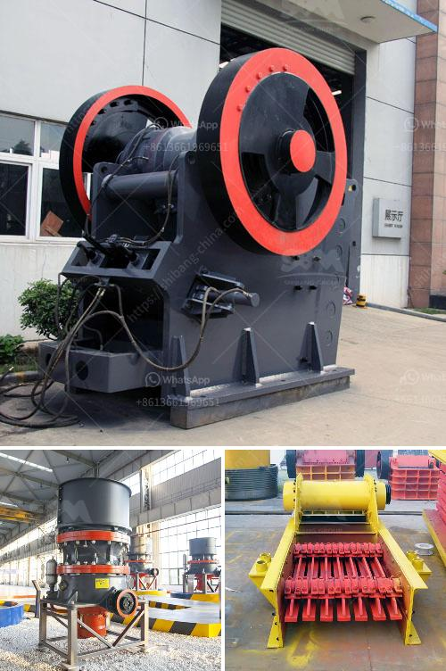

<h3>conveyor belts in peru</h3>
Conveyor belts play a vital role in the industrial sector, and Peru is no exception. Located in South America, Peru boasts a thriving economy supported by various industries such as mining, agriculture, and manufacturing. In each of these sectors, conveyor belts have become an integral part of the production process.

The mining industry in Peru is particularly significant, as it is one of the country's major sources of revenue. Conveyor belts are widely used in mines to transport raw materials, ores, and minerals from one location to another. These belts efficiently move heavy loads over long distances, contributing to increased productivity and reduced labor costs. In addition, conveyor belts in mining also help to minimize the risk of accidents and injuries by providing a safer means of material handling.

Peru's agricultural sector is another area where conveyor belts have found extensive use. With its diverse climate and fertile soil, Peru is a significant exporter of agricultural products such as coffee, fruits, and vegetables. Conveyor belts are employed in food processing plants and packaging facilities to transport harvested crops efficiently. By automating the process, conveyor belts help to streamline operations, reduce product damage, and improve overall efficiency.

Moreover, conveyor belts have revolutionized the manufacturing sector in Peru. As the country continues to attract investment from various industries, manufacturing facilities have witnessed significant growth. Conveyor belts are critical in automating production lines, allowing for more efficient movement of products, components, and raw materials. By connecting different sections of the assembly line, conveyor belts enhance production speed and optimize workflow, reducing bottlenecks and enhancing productivity.

In conclusion, conveyor belts in Peru are an essential component of various industries, including mining, agriculture, and manufacturing. They contribute to increased productivity, improved safety, and streamlined processes, resulting in economic growth and development. As Peru continues to expand its industrial sector, the demand for conveyor belts is likely to rise, making them an integral part of the country's overall progress.
<h3>Contact us</h3><ul><li><strong>Whatsapp:&nbsp;<a href="https://wa.me/8613661969651">+8613661969651</a></strong></li><li><a href="https://swt.shibang-china.com/?git&amp;zhl&amp;conveyor belts in peru"><strong>Online Service(chat now)</strong></a></li></ul><h3>Related</h3><ul><li><a href='smill grinding mill machine price.md'>smill grinding mill machine price</a></li><li><a href='machines for quarrying of stones.md'>machines for quarrying of stones</a></li><li><a href='how does a stone crushing plant work.md'>how does a stone crushing plant work</a></li><li><a href='arriendo de chancadores chile.md'>arriendo de chancadores chile</a></li><li><a href='gold mining equipment stores in tanzania.md'>gold mining equipment stores in tanzania</a></li></ul>