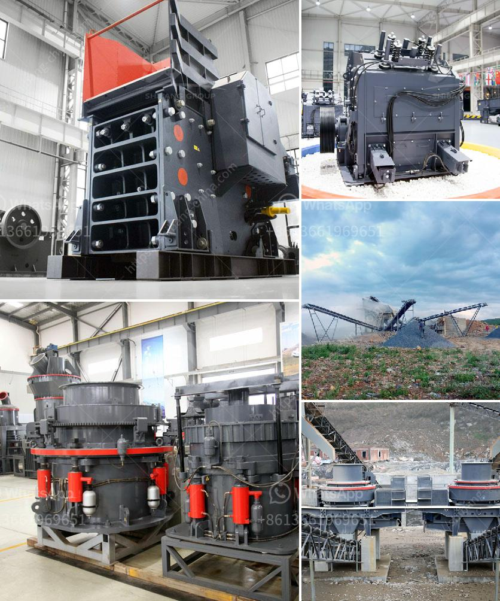

<h3>conveyor belts in zambia</h3>
Zambia, a landlocked country in Southern Africa, has been predominantly reliant on copper mining as a source of export earnings. As the mining industry faces global shifts in commodity demand, technological advancements are becoming increasingly crucial to enhance productivity and efficiency. One such innovation that is revolutionizing the mining sector in Zambia is the use of conveyor belts.

Conveyor belts have been used for decades in various industries, but their significance in mining operations cannot be understated. In Zambia, where large-scale mining operations are prevalent, conveyor belts are enabling companies to transport and handle bulk materials with ease, reducing operational costs and increasing overall productivity.

The use of conveyor belts in Zambia's mining industry has several advantages. Firstly, they are highly efficient and can handle large quantities of materials over long distances. This minimizes the need for manual labor and increases the overall speed of material transportation, leading to significant time and cost savings. Additionally, conveyor belts are designed to operate continuously, eliminating the need for frequent equipment shutdowns and maintenance, which further boosts productivity.

Furthermore, conveyor belts bring immense safety benefits to the mining industry in Zambia. Mining is notorious for its hazardous working conditions, and manual handling of bulk materials can pose serious risks to workers' health and safety. With conveyor belts, the need for manual material handling is significantly reduced, minimizing the likelihood of accidents or injuries. Moreover, conveyor belts are equipped with safety features such as emergency stop buttons and sensors to detect any malfunctions, ensuring the well-being of workers.

Conveyor belts also contribute to the environmental sustainability of mining operations in Zambia. Traditional modes of material transportation involve the use of trucks, which consume substantial amounts of fuel and emit harmful pollutants. By replacing trucks with conveyor belts, mining companies can reduce their carbon footprint and mitigate environmental impacts. Furthermore, conveyor belts are designed to minimize spillage and dust generation, ensuring that precious minerals are not lost during transportation and avoiding air pollution.

The adoption of conveyor belts in Zambia's mining industry has not been without challenges. High initial investment costs and limited access to reliable and affordable maintenance services are some of the hurdles that mining companies have to overcome. However, the long-term benefits, including increased productivity, cost savings, and improved safety records, outweigh the initial investment and maintenance considerations.

In recent years, several mining companies in Zambia have embraced the use of conveyor belts, recognizing their potential to transform the industry. These companies have witnessed significant improvements in their operational efficiency, leading to enhanced competitiveness in the global market. As a result, conveyor belts have become an integral part of modern mining operations, facilitating the movement of bulk materials with utmost efficiency and safety.

In conclusion, conveyor belts are revolutionizing Zambia's mining industry, providing a reliable, efficient, and safe means of transporting bulk materials. By replacing traditional modes of material transportation, mining companies are reaping the benefits of increased productivity, reduced operational costs, improved worker safety, and environmental sustainability. As Zambia continues to diversify its economy, embracing technological advancements such as conveyor belts will be crucial to ensuring the mining sector remains globally competitive, building a sustainable future for the country.
<h3>Contact us</h3><ul><li><strong>Whatsapp:&nbsp;<a href="https://wa.me/8613661969651">+8613661969651</a></strong></li><li><a href="https://swt.shibang-china.com/?git&amp;zhl&amp;conveyor belts in zambia"><strong>Online Service(chat now)</strong></a></li></ul><h3>Related</h3><ul><li><a href='pe jaw crusher.md'>pe jaw crusher</a></li><li><a href='used stone crusher for sale germany.md'>used stone crusher for sale germany</a></li><li><a href='top ten manufacturers of stone crusher in the world.md'>top ten manufacturers of stone crusher in the world</a></li><li><a href='denver roll crusher for sale.md'>denver roll crusher for sale</a></li><li><a href='fly ash electrostatic separator manufacturer.md'>fly ash electrostatic separator manufacturer</a></li></ul>