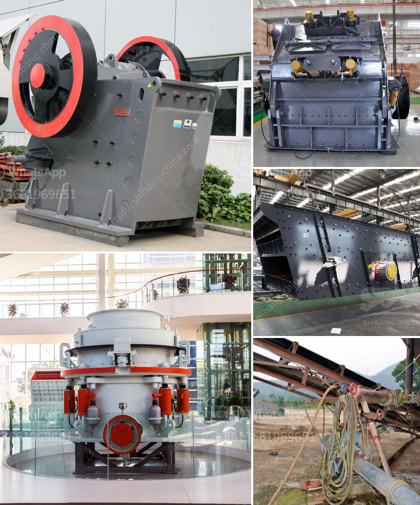

<h3>conveyor belts malaysia</h3>
Conveyor belts serve as an essential component in various industries, facilitating the movement of goods, materials, and products efficiently and safely. As such, selecting the right conveyor belt is crucial to ensure smooth operations, minimize downtime, and maximize productivity.

In Malaysia, there is a wide selection of conveyor belts available for various applications, including food processing, pharmaceutical, agricultural, manufacturing, and logistics industries. With the significant growth of the country's industrial sector, the demand for conveyor belts continues to rise, leading to the emergence of many conveyor belt suppliers in Malaysia.

When choosing conveyor belts in Malaysia, there are several key factors to consider. Firstly, it is essential to understand the specific requirements and operational environment of your industry. Different industries have different needs, and conveyor belts come in various types, materials, and designs to suit these requirements.

One popular type of conveyor belt is the modular belt. Made of interlocking plastic modules, these belts are highly customizable, allowing for easy maintenance and quick belt replacement. They are ideal for transporting products with irregular shapes or along inclines and declines. Modular belts are commonly found in the food processing and pharmaceutical industries, where hygiene and cleanliness are crucial.

Another commonly used conveyor belt is the PVC belt, known for its durability and resistance to chemicals and oils. PVC belts are widely used in industries such as manufacturing, logistics, and mining, where heavy-duty materials and continuous operations are the norm. With their rough top surface, PVC belts provide excellent grip and prevent product slippage during transportation.

For industries that require high-speed operations, timing belts are a preferred choice. These belts have tooth-like structures that fit into grooves on the conveyor pulleys, ensuring precise and synchronized movement. The automotive industry often utilizes timing belts in assembly lines, where components need to be accurately positioned to achieve smooth production processes.

In addition to the type of belt, it is crucial to consider the material used in its construction. Conveyor belts can be made from various materials, including rubber, polyurethane, nylon, and metal. The choice of material depends on factors such as the type of product being transported, environmental conditions, and required belt strength.

Rubber conveyor belts are versatile and widely used due to their excellent resistance to wear and tear. They can handle heavy loads and are suitable for various industries. Polyurethane belts, on the other hand, offer superior resistance to abrasion, greases, and oils, making them perfect for the food processing and automotive industries.

When selecting conveyor belts in Malaysia, it is vital to source them from reputable suppliers with a proven track record in the industry. These suppliers should offer a wide range of belts that meet international quality standards and provide reliable after-sales service, including maintenance, repair, and emergency support.

In conclusion, conveyor belts play a vital role in many industries in Malaysia. Understanding the specific requirements of your industry and selecting the appropriate type and material of conveyor belt are crucial to ensure optimal performance and productivity. By partnering with reliable suppliers, businesses can enhance their operations and achieve long-term success.
<h3>Contact us</h3><ul><li><strong>Whatsapp:&nbsp;<a href="https://wa.me/8613661969651">+8613661969651</a></strong></li><li><a href="https://swt.shibang-china.com/?git&amp;zhl&amp;conveyor belts malaysia"><strong>Online Service(chat now)</strong></a></li></ul><h3>Related</h3><ul><li><a href='complete mining equipment in accra ghana.md'>complete mining equipment in accra ghana</a></li><li><a href='gold wash plant irs california.md'>gold wash plant irs california</a></li><li><a href='mobile stone crushing machine in america.md'>mobile stone crushing machine in america</a></li><li><a href='dolomite powder machine.md'>dolomite powder machine</a></li><li><a href='kaolin crusher processing machine.md'>kaolin crusher processing machine</a></li></ul>