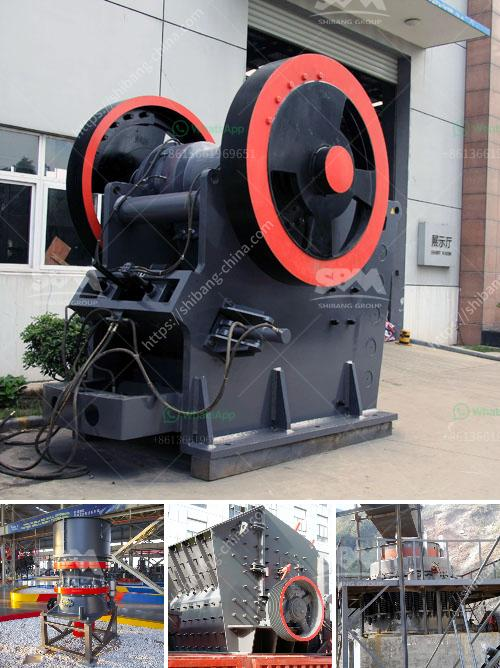

<h3>conveyor belts price</h3>
Conveyor belts are an essential component in various industries as they play a crucial role in the transportation of goods and materials. They are commonly used in manufacturing, mining, agriculture, and logistics sectors, among others. Like any other equipment, cost plays a significant role in determining the viability of conveyor belts for businesses. In this article, we will discuss the factors that influence conveyor belt prices.

One of the primary factors determining conveyor belt prices is the type of material used in their construction. Conveyor belts can be made from various materials, including rubber, PVC, polyester, and metal. Rubber belts are the most common choice for many industries due to their versatility and durability. PVC belts are often used in the food industry due to their resistance to oils, fats, and chemicals. Polyester belts are ideal for heavy-duty applications, while metal belts are suitable for high-temperature environments.

The size and configuration of the conveyor belt system also affect their prices. Conveyor belts come in different widths, lengths, and thicknesses, depending on the specific requirements of each application. Longer and wider belts will generally cost more due to the increased material and manufacturing processes involved. Additionally, specialized configurations, such as incline or decline belts, spiral or curved belts, and modular belts, may have higher price tags due to their unique designs and manufacturing methods.

Another crucial factor that influences conveyor belt prices is the quality and reliability of the equipment. Investing in high-quality belts can result in longer service life, lower maintenance costs, and reduced downtime. While they might have a higher upfront cost, superior-quality belts often prove to be more cost-effective in the long run. Cheaper belts may require frequent replacements, leading to increased expenses and disruptions to operations.

The application requirements also play a significant role in determining conveyor belt prices. For example, if the belt will be used in a harsh or extreme environment, such as underground mining or chemical processing plants, it may require additional features like heat resistance, flame retardancy, or chemical resistance. These specialized belts, designed to withstand demanding conditions, tend to be more expensive due to the incorporation of additional manufacturing techniques and unique materials.

Furthermore, the brand reputation and supplier influence conveyor belt prices. Well-established manufacturers often charge a premium for their products due to their reputation for quality and reliability. They invest in research and development to continuously improve their products, which may result in higher costs. However, opting for a reputable brand ensures that the conveyor belt meets industry standards and adheres to safety regulations.

Lastly, the overall demand and market conditions can affect conveyor belt prices. If there is a high demand for conveyor belts, prices may increase due to the limited availability of resources and manufacturing capacity. Market factors such as fluctuations in raw material prices and economic conditions can also impact the pricing structure.

In conclusion, several factors influence conveyor belt prices, including the type of material, size and configuration, quality and reliability, application requirements, brand reputation, and market conditions. When considering conveyor belts, it is crucial for businesses to evaluate their specific needs and carefully assess these factors to make a well-informed decision. While price is undoubtedly an essential consideration, it is equally important to prioritize durability, performance, and reliability to ensure long-term value and operational efficiency.
<h3>Contact us</h3><ul><li><strong>Whatsapp:&nbsp;<a href="https://wa.me/8613661969651">+8613661969651</a></strong></li><li><a href="https://swt.shibang-china.com/?git&amp;zhl&amp;conveyor belts price"><strong>Online Service(chat now)</strong></a></li></ul><h3>Related</h3><ul><li><a href='diesel grinding mills musina south africa.md'>diesel grinding mills musina south africa</a></li><li><a href='mobile stone crushing machine for sale.md'>mobile stone crushing machine for sale</a></li><li><a href='set up a quarry plant.md'>set up a quarry plant</a></li><li><a href='central shaft for stone crusher.md'>central shaft for stone crusher</a></li><li><a href='dry ball mill in lima peru.md'>dry ball mill in lima peru</a></li></ul>