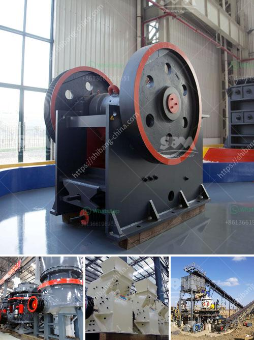

<h3>conveyor supplier in the philippines</h3>
Conveyor systems are an integral part of many industries, serving as a cost-effective and efficient means to transport materials and products within a facility. In the Philippines, where various industries continue to thrive, the need for reliable conveyor suppliers is significant. These suppliers play a crucial role in ensuring the smooth operational flow of businesses and optimizing productivity.

One of the leading conveyor suppliers in the Philippines is ABC Machinery & Industrial Supply. With their extensive experience and expertise, they have become a trusted partner for numerous industries, including food processing, automotive, pharmaceutical, and manufacturing. This supplier understands the unique requirements of different sectors and provides tailored solutions to meet their clients' specific needs.

ABC Machinery & Industrial Supply offers a wide range of conveyor systems, including belt conveyors, roller conveyors, chain conveyors, and screw conveyors. Belt conveyors are commonly used for the transportation of bulk materials, such as coal, grain, and aggregates. Roller conveyors are ideal for moving products with flat or smooth bottoms, while chain conveyors are suitable for heavy-duty applications. Screw conveyors, on the other hand, are used for handling bulk materials in a controlled manner.

The quality of conveyor systems is a critical factor to consider when choosing a supplier. ABC Machinery & Industrial Supply takes pride in providing high-quality conveyors that are durable and reliable. These systems are designed to withstand heavy loads and harsh environments, ensuring long-term performance and minimal downtime. Additionally, their conveyors are equipped with safety features to protect workers and prevent accidents.

In addition to supplying reliable conveyor systems, ABC Machinery & Industrial Supply also offers maintenance and repair services. Regular maintenance is essential to keep conveyor systems in optimal condition and prevent unexpected breakdowns. This supplier has a team of experienced technicians who can conduct routine inspections, identify potential issues, and carry out necessary repairs to ensure uninterrupted operations.

ABC Machinery & Industrial Supply understands that every industry has unique requirements and challenges. They work closely with their clients to determine the most suitable conveyor systems for their specific needs. Their team of experts conducts thorough assessments, taking into account factors such as material type, weight, throughput, and layout. By providing customized solutions, they help their clients enhance efficiency, streamline operations, and ultimately achieve higher profitability.

Apart from their comprehensive range of conveyor systems and maintenance services, ABC Machinery & Industrial Supply also prioritizes excellent customer service. They have a dedicated support team that is always ready to assist clients with any inquiries or concerns. Whether it's providing technical advice, offering recommendations, or addressing post-purchase queries, this supplier ensures that their clients receive prompt and reliable assistance.

In conclusion, conveyor suppliers play a vital role in the Philippines' industrial landscape, providing businesses with cost-effective and efficient solutions for material handling. ABC Machinery & Industrial Supply stands out as a leading supplier, offering a wide range of high-quality conveyor systems tailored to meet various industry requirements. With their expertise, dedication to customer service, and commitment to delivering reliable solutions, they continue to be a trusted partner for businesses across the country.
<h3>Contact us</h3><ul><li><strong>Whatsapp:&nbsp;<a href="https://wa.me/8613661969651">+8613661969651</a></strong></li><li><a href="https://swt.shibang-china.com/?git&amp;zhl&amp;conveyor supplier in the philippines"><strong>Online Service(chat now)</strong></a></li></ul><h3>Related</h3><ul><li><a href='stone crusher for hire south africa.md'>stone crusher for hire south africa</a></li><li><a href='jaw crusher supplier in philippines.md'>jaw crusher supplier in philippines</a></li><li><a href='size to a jaw crusher and cone crusher.md'>size to a jaw crusher and cone crusher</a></li><li><a href='crusher machine for sale in pakistan.md'>crusher machine for sale in pakistan</a></li><li><a href='sale stone quarry crusher plant india.md'>sale stone quarry crusher plant india</a></li></ul>