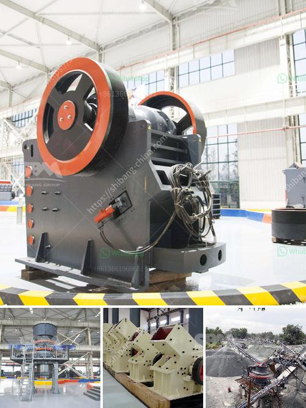

<h3>copper beneficiation</h3>
Copper is one of the most widely used metals in various industries, primarily due to its excellent conductivity and corrosion resistance. However, before it can be put to use in its purest form, copper must first go through a process called beneficiation. This process aims to extract and refine copper from its ore, transforming it into a more valuable product.

The primary objective of copper beneficiation is to increase the concentration of copper in the ore, ensuring its purity and enabling its use in various applications. This process involves crushing and grinding the ore to a fine size, followed by flotation and other techniques to separate the copper minerals from the unwanted gangue materials.

One of the most common methods of copper beneficiation is flotation, where air bubbles are introduced to the ore-water mixture. The copper minerals attach to the bubbles and rise to the surface, forming a froth that can be collected and further processed. This technique allows for the recovery of up to 90% of the copper present in the ore.

Another important aspect of copper beneficiation is the removal of impurities such as iron, sulfur, and other elements that can negatively impact the quality of the final product. Various chemical reagents and physical methods are employed to achieve this, ensuring that the copper obtained is of high purity and suitable for different industrial applications.

Copper beneficiation not only increases the value of this versatile metal but also has positive environmental implications. By reducing the amount of unwanted materials in the ore, the overall amount of waste generated is decreased. Furthermore, the extraction and refining processes are designed to minimize the release of pollutants and conserve resources.

In conclusion, copper beneficiation plays a crucial role in unlocking the potential of this versatile metal. By extracting and refining copper from its ore, it becomes a valuable resource that can be utilized in a wide range of industries, from electrical and electronics to construction and transportation. This process not only enhances the economic value of copper but also helps protect the environment by reducing waste and minimizing pollution.
<h3>Contact us</h3><ul><li><strong>Whatsapp:&nbsp;<a href="https://wa.me/8613661969651">+8613661969651</a></strong></li><li><a href="https://swt.shibang-china.com/?git&amp;zhl&amp;copper beneficiation"><strong>Online Service(chat now)</strong></a></li></ul><h3>Related</h3><ul><li><a href='business plan for gypsum production.md'>business plan for gypsum production</a></li><li><a href='limestone powder manufacture machine.md'>limestone powder manufacture machine</a></li><li><a href='crushers manufactures in.md'>crushers manufactures in</a></li><li><a href='quarry equipment and crushers companies in japan.md'>quarry equipment and crushers companies in japan</a></li><li><a href='gold corporation ball mill.md'>gold corporation ball mill</a></li></ul>